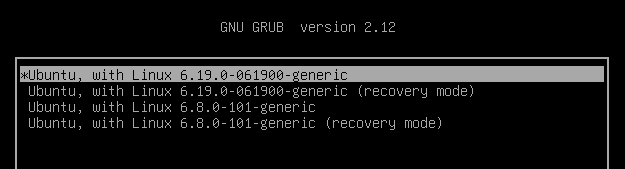

# ДЗ № 1
## Тема: Обновление ядра системы.

Задание:
- Запустите ВМ c Ubuntu.
- Обновите ядро ОС на новейшую стабильную версию из mainline-репозитория.
- Оформите отчет в README-файле в GitHub-репозитории.
  
## Выполнение задания
Изначально имеем VM с Ubuntu 24.04.4 LTC
```
root@server:/home/user# cat /etc/os-release
PRETTY_NAME="Ubuntu 24.04.4 LTS"
NAME="Ubuntu"
VERSION_ID="24.04"
VERSION="24.04.4 LTS (Noble Numbat)"
VERSION_CODENAME=noble
ID=ubuntu
ID_LIKE=debian
HOME_URL="https://www.ubuntu.com/"
SUPPORT_URL="https://help.ubuntu.com/"
BUG_REPORT_URL="https://bugs.launchpad.net/ubuntu/"
PRIVACY_POLICY_URL="https://www.ubuntu.com/legal/terms-and-policies/privacy-policy"
UBUNTU_CODENAME=noble
LOGO=ubuntu-logo
root@server:/home/user# uname -r
6.8.0-101-generic
```
В качестве нового, выбрал ядро v6.19\
Загрузил необходимые deb пакеты на хостовую машину и с помощью scp закинул их на VM
```
scp ./linux*.deb user@192.168.0.25:~/newcore_v6.19
user@192.168.0.25's password:
linux-headers-6.19.0-061900-generic_6.19.0-061900.202602082231_amd64.deb              100% 3950KB 128.6MB/s   00:00
linux-headers-6.19.0-061900_6.19.0-061900.202602082231_all.deb                        100%   14MB 100.3MB/s   00:00
linux-image-unsigned-6.19.0-061900-generic_6.19.0-061900.202602082231_amd64.deb       100%   17MB 159.0MB/s   00:00
linux-modules-6.19.0-061900-generic_6.19.0-061900.202602082231_amd64.deb              100%  160MB 209.5MB/s   00:00
```
На VM из под root выполнил следуюшие команды:
```
cd /home/user/newcore_v6.19/
dpkg -i *.deb
```
Для удобства в /etc/default/grub параметр GRUB_TIMEOUT изменил на 3 (задержка перед загрузкой 3 сек.)\
Далее
```
update-grub
```
Затем перезагрузил VM и выбрал загрузку нового ядра\


Провереил что ядро действительно новое
```
uname -r
6.19.0-061900-generic
```
