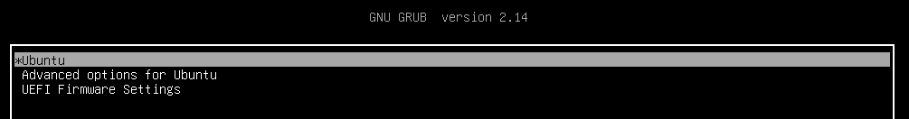

# ДЗ № 7
## Тема: Работа с загрузчиком
Задание:
1. Включить отображение меню Grub.
2. Попасть в систему без пароля несколькими способами.
3. Установить систему с LVM, после чего переименовать VG.

## Включаем отображение меню Grub.
Прописываем в файле /etc/default/grub следующие строки:
GRUB_TIMEOUT_STYLE=menu
GRUB_TIMEOUT=5
Выполняем команду
```
root@server:/etc/default# update-grub
```
Перезагружаемся и смотрим, что вышло

В ходе загрузки появилось меню GRUB

## Заходим в систему без пароля от root'а несколькими способами.


## Переименовываем VG и LV root'а на системе установленной на LVM.
Изначально имеем
```
root@server:/# lsblk
NAME                      MAJ:MIN RM  SIZE RO TYPE MOUNTPOINTS
sda                         8:0    0   50G  0 disk
├─sda1                      8:1    0    1M  0 part
├─sda2                      8:2    0    2G  0 part /boot
└─sda3                      8:3    0   48G  0 part
  └─ubuntu--vg-ubuntu--lv 252:0    0   24G  0 lvm  /
sr0                        11:0    1 1024M  0 rom
root@server:/# lvs
  LV        VG            Attr       LSize   Pool Origin Data%  Meta%  Move Log Cpy%Sync Convert
  ubuntu-lv ubuntu-vg -wi-ao---- <24.00g      
```

Переименовываем VG ubuntu-vg в new-ubuntu-vg, а LV ubuntu-lv в new-ubuntu-lv и проверяем результат
```
root@server:/# vgrename ubuntu-vg new-ubuntu-vg
  Volume group "ubuntu-vg" successfully renamed to "new-ubuntu-vg"
root@server:/# lvrename new-ubuntu-vg/ubuntu-lv new-ubuntu-lv
  Renamed "ubuntu-lv" to "new-ubuntu-lv" in volume group "new-ubuntu-vg"
root@server:/# lvs
  LV            VG            Attr       LSize   Pool Origin Data%  Meta%  Move Log Cpy%Sync Convert
  new-ubuntu-lv new-ubuntu-vg -wi-ao---- <24.00g
```

Редактируем файл /boot/grub/grub.cfg В строках \
linux   /vmlinuz-6.8.0-101-generic root=/dev/mapper/ubuntu--vg-ubuntu--lv ro \
linux   /vmlinuz-6.8.0-101-generic root=/dev/mapper/ubuntu--vg-ubuntu--lv ro recovery nomodeset dis_ucode_ldr \
в место ubuntu--vg-ubuntu--lv втавляем new--ubuntu--vg-new--ubuntu--lv 

Перезагружаемся и смотрим, что вышло
```
root@server:/# lsblk
NAME                                MAJ:MIN RM  SIZE RO TYPE MOUNTPOINTS
sda                                   8:0    0   50G  0 disk
├─sda1                                8:1    0    1M  0 part
├─sda2                                8:2    0    2G  0 part /boot
└─sda3                                8:3    0   48G  0 part
  └─new--ubuntu--vg-new--ubuntu--lv 252:0    0   24G  0 lvm  /
sr0                                  11:0    1 1024M  0 rom
root@server:/# lvs
  LV            VG            Attr       LSize   Pool Origin Data%  Meta%  Move Log Cpy%Sync Convert
  new-ubuntu-lv new-ubuntu-vg -wi-ao---- <24.00g
```
Все работаем
