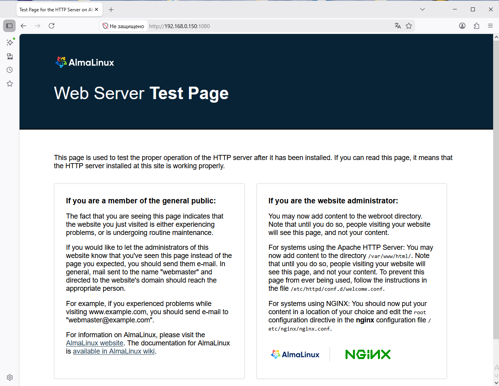

# ДЗ № 11
## Тема: SELinux
Задание: 
 1. Запустить Nginx на нестандартном порту 3-мя разными способами:
	- переключатели setsebool;
	- добавление нестандартного порта в имеющийся тип;
	- формирование и установка модуля SELinux.

 2. Обеспечить работоспособность приложения при включенном selinux.
	- развернуть приложенный стенд https://github.com/Nickmob/vagrant_selinux_dns_problems; 
	- выяснить причину неработоспособности механизма обновления зоны (см. README);
	- предложить решение (или решения) для данной проблемы;
	- выбрать одно из решений для реализации, предварительно обосновав выбор;
	- реализовать выбранное решение и продемонстрировать его работоспособность.

## Выполнение задания №1
Имеется VM с ОС AlmaLinux 9.7 (IP: 192.168.0.150) с установленным Nginx (в firewalld порты 80, 1080 для входящих соединений открыты)
SELinux включен, режим: enforcing, текущие политики: targeted
```
[root@localhost /]# sestatus
SELinux status:                 enabled
SELinuxfs mount:                /sys/fs/selinux
SELinux root directory:         /etc/selinux
Loaded policy name:             targeted
Current mode:                   enforcing
Mode from config file:          enforcing
Policy MLS status:              enabled
Policy deny_unknown status:     allowed
Memory protection checking:     actual (secure)
Max kernel policy version:      33
```
Меняем стандартный порт Nginx на 1080 (в файле /etc/nginx/nginx.conf меняем значение listen на 1080 и перезапускаем Nginx) \
В результате Nginx не запускается.
```
[root@localhost /]# systemctl restart nginx
Job for nginx.service failed because the control process exited with error code.
See "systemctl status nginx.service" and "journalctl -xeu nginx.service" for details.

[root@localhost /]# journalctl -u nginx -b
May 30 11:16:30 localhost.localdomain systemd[1]: Starting The nginx HTTP and reverse proxy server...
May 30 11:16:30 localhost.localdomain nginx[2537]: nginx: the configuration file /etc/nginx/nginx.conf syntax is ok
May 30 11:16:30 localhost.localdomain nginx[2537]: nginx: [emerg] bind() to 0.0.0.0:1080 failed (13: Permission denied)
May 30 11:16:30 localhost.localdomain nginx[2537]: nginx: configuration file /etc/nginx/nginx.conf test failed
May 30 11:16:30 localhost.localdomain systemd[1]: nginx.service: Control process exited, code=exited, status=1/FAILURE
May 30 11:16:30 localhost.localdomain systemd[1]: nginx.service: Failed with result 'exit-code'.
May 30 11:16:30 localhost.localdomain systemd[1]: Failed to start The nginx HTTP and reverse proxy server.
```
Исправляем ситуацию ...

Подход №1 (используем setsebool) \
Изучаем проблему 
```
cat /var/log/audit/audit.log | audit2why


type=AVC msg=audit(1780128990.871:146): avc:  denied  { name_bind } for  pid=2537 comm="nginx" src=1080 scontext=system_u:system_r:httpd_t:s0 tcontext=system_u:object_r:unreserved_port_t:s0 tclass=tcp_socket permissive=0

        Was caused by:
        The boolean nis_enabled was set incorrectly.
        Description:
        Allow nis to enabled

        Allow access by executing:
        # setsebool -P nis_enabled 1
```
Следуем совету
```
[root@localhost /]# setsebool -P nis_enabled 1
[root@localhost /]# getsebool -a | grep nis_
nis_enabled --> on
[root@localhost /]# systemctl restart nginx
[root@localhost /]# systemctl status nginx
● nginx.service - The nginx HTTP and reverse proxy server
     Loaded: loaded (/usr/lib/systemd/system/nginx.service; enabled; preset: disabled)
     Active: active (running) since Sat 2026-05-30 11:41:37 MSK; 13s ago
    Process: 2632 ExecStartPre=/usr/bin/rm -f /run/nginx.pid (code=exited, status=0/SUCCESS)
    Process: 2633 ExecStartPre=/usr/sbin/nginx -t (code=exited, status=0/SUCCESS)
    Process: 2634 ExecStart=/usr/sbin/nginx (code=exited, status=0/SUCCESS)
   Main PID: 2635 (nginx)
      Tasks: 2 (limit: 10514)
     Memory: 2.2M (peak: 2.3M)
        CPU: 21ms
     CGroup: /system.slice/nginx.service
             ├─2635 "nginx: master process /usr/sbin/nginx"
             └─2636 "nginx: worker process"

May 30 11:41:37 localhost.localdomain systemd[1]: Starting The nginx HTTP and reverse proxy server...
May 30 11:41:37 localhost.localdomain nginx[2633]: nginx: the configuration file /etc/nginx/nginx.conf syntax is ok
May 30 11:41:37 localhost.localdomain nginx[2633]: nginx: configuration file /etc/nginx/nginx.conf test is successful
May 30 11:41:37 localhost.localdomain systemd[1]: Started The nginx HTTP and reverse proxy server.
```
Заработало. \
Возвращаем проблему для дальнейших эксперементов, делаем: setsebool -P nis_enabled 0

Подход №2 (добавляем нестандартный порт в тип) \
Смотрим с каким доменом работает Nginx
```
[root@localhost /]# ps auxZ | grep nginx
system_u:system_r:httpd_t:s0    root        2635  0.0  0.1  16176  2156 ?        Ss   11:41   0:00 nginx: master process /usr/sbin/nginx
system_u:system_r:httpd_t:s0    nginx       2636  0.0  0.2  16600  3768 ?        S    11:41   0:00 nginx: worker process
unconfined_u:unconfined_r:unconfined_t:s0-s0:c0.c1023 root 2658 0.0  0.1 221680 2384 pts/0 S+ 11:49   0:00 grep --color=auto nginx
```
Видим, что это httpd_t \
Смотрим порты с какими типами контекста безопасности можено прослушивать из этого домена
```
[root@localhost /]# sesearch -A -s httpd_t -c tcp_socket -p name_bind
allow httpd_t commplex_main_port_t:tcp_socket name_bind; [ httpd_use_openstack ]:True
allow httpd_t ephemeral_port_type:tcp_socket name_bind; [ httpd_enable_ftp_server ]:True
allow httpd_t ftp_port_t:tcp_socket name_bind; [ httpd_enable_ftp_server ]:True
allow httpd_t http_cache_port_t:tcp_socket name_bind;
allow httpd_t http_port_t:tcp_socket name_bind;
allow httpd_t jboss_management_port_t:tcp_socket name_bind;
allow httpd_t jboss_messaging_port_t:tcp_socket name_bind;
allow httpd_t ntop_port_t:tcp_socket name_bind;
allow httpd_t preupgrade_port_t:tcp_socket name_bind; [ httpd_run_preupgrade ]:True
allow httpd_t puppet_port_t:tcp_socket name_bind;
allow nsswitch_domain ephemeral_port_t:tcp_socket name_bind; [ nis_enabled ]:True
allow nsswitch_domain port_t:tcp_socket name_bind; [ nis_enabled ]:True
allow nsswitch_domain unreserved_port_t:tcp_socket name_bind; [ nis_enabled ]:True
```
Из списка выбираем тип порта http_port_t и смотрим какие порты имеют этот тип ("связаны" с ним и сейчас "доступны" для домена httpd_t)
```
[root@localhost /]# semanage port -l | grep http_port_t
http_port_t                    tcp      80, 81, 443, 488, 8008, 8009, 8443, 9000
pegasus_http_port_t            tcp      5988
```
"Связываем" порт 1080 с типом http_port_t \
на самом деле тип может быть любой из "разрешенных" для домена httpd_t (например, jboss_management_port_t)
```
[root@localhost /]# semanage port -a -t http_port_t -p tcp 1080
[root@localhost /]# semanage port -l | grep http_port_t
http_port_t                    tcp      1080, 80, 81, 443, 488, 8008, 8009, 8443, 9000
pegasus_http_port_t            tcp      5988
[root@localhost /]# systemctl restart nginx
[root@localhost /]# systemctl status nginx
● nginx.service - The nginx HTTP and reverse proxy server
     Loaded: loaded (/usr/lib/systemd/system/nginx.service; enabled; preset: disabled)
     Active: active (running) since Sat 2026-05-30 12:45:56 MSK; 7s ago
    Process: 3372 ExecStartPre=/usr/bin/rm -f /run/nginx.pid (code=exited, status=0/SUCCESS)
    Process: 3373 ExecStartPre=/usr/sbin/nginx -t (code=exited, status=0/SUCCESS)
    Process: 3374 ExecStart=/usr/sbin/nginx (code=exited, status=0/SUCCESS)
   Main PID: 3375 (nginx)
      Tasks: 2 (limit: 10514)
     Memory: 2.2M (peak: 2.5M)
        CPU: 21ms
     CGroup: /system.slice/nginx.service
             ├─3375 "nginx: master process /usr/sbin/nginx"
             └─3376 "nginx: worker process"

May 30 12:45:56 localhost.localdomain systemd[1]: Starting The nginx HTTP and reverse proxy server...
May 30 12:45:56 localhost.localdomain nginx[3373]: nginx: the configuration file /etc/nginx/nginx.conf syntax is ok
May 30 12:45:56 localhost.localdomain nginx[3373]: nginx: configuration file /etc/nginx/nginx.conf test is successful
May 30 12:45:56 localhost.localdomain systemd[1]: Started The nginx HTTP and reverse proxy server.
```
Все работает \
Удаляем "привязку" порта 1080 к типу http_port_t
```
[root@localhost /]# semanage port -d -t http_port_t -p tcp 1080
[root@localhost /]# systemctl restart nginx
Job for nginx.service failed because the control process exited with error code.
See "systemctl status nginx.service" and "journalctl -xeu nginx.service" for details.
```
Ngins снова не работает

Подход №3 (формируем и устанавливаем новый модуль SELinux) \
С помощью audit2allow анализируем ошибки (блокировки) Nginx (лог /var/log/audit/audit.log) и формируем политику, \
которая должна исправиить ситуацию. Такде смотрим, какие правила вошли в новую политику. \
Использую tail -n 40 т.к. в результате некоторых экперементов в логе оказалось много лишнего и \
если скармливать audit2allow его целиком, даже фильтруя по nginx в политике будет много ненужных правил.
```
[root@localhost /]# tail -n 40 /var/log/audit/audit.log | grep nginx | audit2allow -M nginx
******************** IMPORTANT ***********************
To make this policy package active, execute:

semodule -i nginx.pp

[root@localhost /]# cat nginx.te

module nginx 1.0;

require {
        type httpd_t;
        type unreserved_port_t;
        class tcp_socket name_bind;
}

#============= httpd_t ==============

#!!!! This avc can be allowed using the boolean 'nis_enabled'
allow httpd_t unreserved_port_t:tcp_socket name_bind;
```
Применяем новую политику и смотрим, что получилось
```
[root@localhost /]# semodule -i nginx.pp
[root@localhost /]# systemctl restart nginx
[root@localhost /]# systemctl status nginx
● nginx.service - The nginx HTTP and reverse proxy server
     Loaded: loaded (/usr/lib/systemd/system/nginx.service; enabled; preset: disabled)
     Active: active (running) since Sat 2026-05-30 13:39:58 MSK; 14s ago
    Process: 3573 ExecStartPre=/usr/bin/rm -f /run/nginx.pid (code=exited, status=0/SUCCESS)
    Process: 3574 ExecStartPre=/usr/sbin/nginx -t (code=exited, status=0/SUCCESS)
    Process: 3575 ExecStart=/usr/sbin/nginx (code=exited, status=0/SUCCESS)
   Main PID: 3576 (nginx)
      Tasks: 2 (limit: 10514)
     Memory: 2.2M (peak: 2.3M)
        CPU: 27ms
     CGroup: /system.slice/nginx.service
             ├─3576 "nginx: master process /usr/sbin/nginx"
             └─3577 "nginx: worker process"

May 30 13:39:58 localhost.localdomain systemd[1]: Starting The nginx HTTP and reverse proxy server...
May 30 13:39:58 localhost.localdomain nginx[3574]: nginx: the configuration file /etc/nginx/nginx.conf syntax is ok
May 30 13:39:58 localhost.localdomain nginx[3574]: nginx: configuration file /etc/nginx/nginx.conf test is successful
May 30 13:39:58 localhost.localdomain systemd[1]: Started The nginx HTTP and reverse proxy server.
```
Все работает.


## Выполнение задания №2
Проверяем работоспособность заранее развернутого стенда
```
[vagrant@client ~]$ dig @192.168.50.10 ns01.dns.lab

; <<>> DiG 9.16.23-RH <<>> @192.168.50.10 ns01.dns.lab
; (1 server found)
;; global options: +cmd
;; Got answer:
;; ->>HEADER<<- opcode: QUERY, status: NOERROR, id: 23743
;; flags: qr aa rd ra; QUERY: 1, ANSWER: 1, AUTHORITY: 0, ADDITIONAL: 1

;; OPT PSEUDOSECTION:
; EDNS: version: 0, flags:; udp: 1232
; COOKIE: 4ee06e9062fee747010000006a1c8983f19ff63af5903696 (good)
;; QUESTION SECTION:
;ns01.dns.lab.			IN	A

;; ANSWER SECTION:
ns01.dns.lab.		3600	IN	A	192.168.50.10

;; Query time: 2 msec
;; SERVER: 192.168.50.10#53(192.168.50.10)
;; WHEN: Sun May 31 19:18:27 UTC 2026
;; MSG SIZE  rcvd: 85
```

Начинаем выполнять задание
```
[vagrant@client ~]$ nsupdate -k /etc/named.zonetransfer.key
> server 192.168.50.10
> zone ddns.lab
> update add www.ddns.lab. 60 A 192.168.50.15
> send
update failed: SERVFAIL
```
Видим, что nameserver не смог обработать запрос, вероятно проблема в нем. 
Но на всяки случай, анализирем журнал аудита VM client с помощью audit2why
```
[root@client /]# cat /var/log/audit/audit.log | audit2why
```
Видим, что ошибок, связанных с проблемой, нет
Лезем на nemeserver и смотрим логи там
```
[root@ns01 named]# systemctl status named

Jun 01 04:46:52 ns01 named[857]: client @0x7fb0fcf0bd78 192.168.50.15#57104/key zonetransfer.key: view view1: signer "zonetransfer.key" approved
Jun 01 04:46:52 ns01 named[857]: client @0x7fb0fcf0bd78 192.168.50.15#57104/key zonetransfer.key: view view1: updating zone 'ddns.lab/IN': adding an RR at 'www.ddns.lab' A 192.168.50.15
Jun 01 04:46:52 ns01 named[857]: /etc/named/dynamic/named.ddns.lab.view1.jnl: create: permission denied
Jun 01 04:46:52 ns01 named[857]: client @0x7fb0fcf0bd78 192.168.50.15#57104/key zonetransfer.key: view view1: updating zone 'ddns.lab/IN': error: journal open failed: unexpected error

[root@ns01 named]# cat /var/log/audit/audit.log | grep named | audit2why
type=AVC msg=audit(1780289212.963:95): avc:  denied  { write } for  pid=857 comm="isc-net-0001" name="dynamic" dev="sda4" ino=33851503 scontext=system_u:system_r:named_t:s0 tcontext=unconfined_u:object_r:named_conf_t:s0 tclass=dir permissive=0

	Was caused by:
		Missing type enforcement (TE) allow rule.

		You can use audit2allow to generate a loadable module to allow this access.
```
Видим, что проблема в директории /etc/named/dynamic, имеющей контекст named_conf_t
Проверяем это
```
[root@ns01 named]# ls -alZ /etc/named 
total 28
drw-rwx---.  3 root named system_u:object_r:named_conf_t:s0      121 May 31 19:15 .
drwxr-xr-x. 87 root root  system_u:object_r:etc_t:s0            8192 Jun  1 04:16 ..
drw-rwx---.  2 root named unconfined_u:object_r:named_conf_t:s0   56 May 31 19:15 dynamic
-rw-rw----.  1 root named system_u:object_r:named_conf_t:s0      784 May 31 19:15 named.50.168.192.rev
-rw-rw----.  1 root named system_u:object_r:named_conf_t:s0      610 May 31 19:15 named.dns.lab
-rw-rw----.  1 root named system_u:object_r:named_conf_t:s0      609 May 31 19:15 named.dns.lab.view1
-rw-rw----.  1 root named system_u:object_r:named_conf_t:s0      657 May 31 19:15 named.newdns.lab
```
Видим, что беда также с директорией /etc/named
Гуглим какой контекст безопасности должен быть для файлов зон. Можем также посмотреть контекст у "правильных" файлов и директорий в которых они находятся (например, /var/named/).
```
[root@ns01 var]# ls -alZ /var/named/
total 20
drwxrwx--T.  5 root  named system_u:object_r:named_zone_t:s0   127 Jun  1 05:14 .
drwxr-xr-x. 20 root  root  system_u:object_r:var_t:s0         4096 May 31 19:14 ..
drwxrwx---.  2 named named system_u:object_r:named_cache_t:s0   23 May 31 19:15 data
drwxrwx---.  2 named named system_u:object_r:named_cache_t:s0   94 May 31 20:15 dynamic
-rw-r-----.  1 root  named system_u:object_r:named_conf_t:s0  2112 May 21 10:22 named.ca
-rw-r-----.  1 root  named system_u:object_r:named_zone_t:s0   152 May 21 10:22 named.empty
-rw-r-----.  1 root  named system_u:object_r:named_zone_t:s0   152 May 21 10:22 named.localhost
-rw-r-----.  1 root  named system_u:object_r:named_zone_t:s0   168 May 21 10:22 named.loopback
drwxrwx---.  2 named named system_u:object_r:named_cache_t:s0    6 May 21 10:29 slaves

```
Выясняем, что контекс безопасности должен быть: named_zone_t \
Меняем для директории /etc/named всего, что в ней тип контекста на named_zone_t
```
root@ns01 /]# chcon -R -t named_zone_t /etc/named
[root@ns01 /]# ls -alZ /etc/named
total 28
drw-rwx---.  3 root named system_u:object_r:named_zone_t:s0      121 May 31 19:15 .
drwxr-xr-x. 87 root root  system_u:object_r:etc_t:s0            8192 Jun  1 15:42 ..
drw-rwx---.  2 root named unconfined_u:object_r:named_zone_t:s0   56 May 31 19:15 dynamic
-rw-rw----.  1 root named system_u:object_r:named_zone_t:s0      784 May 31 19:15 named.50.168.192.rev
-rw-rw----.  1 root named system_u:object_r:named_zone_t:s0      610 May 31 19:15 named.dns.lab
-rw-rw----.  1 root named system_u:object_r:named_zone_t:s0      609 May 31 19:15 named.dns.lab.view1
-rw-rw----.  1 root named system_u:object_r:named_zone_t:s0      657 May 31 19:15 named.newdns.lab

```
Идем в VM client и пробуем сменить привязку домена
```
[vagrant@client ~]$ nsupdate -k /etc/named.zonetransfer.key
> server 192.168.50.10
> zone ddns.lab                                       
> update add www.ddns.lab. 60 A 192.168.50.15
> send
> quit
[vagrant@client ~]$ nslookup www.ddns.lab 192.168.50.10
Server:		192.168.50.10
Address:	192.168.50.10#53

Name:	www.ddns.lab
Address: 192.168.50.15
```
Все заработало. \
Для проверки перзагружаемся и делаем еще одну запись в нашей доменной зоне 
```
[vagrant@client ~]$ nsupdate -k /etc/named.zonetransfer.key
> server 192.168.50.10
> zone ddns.lab
> update add web.ddns.lab. 60 A 192.168.50.25
> send
> quit
[vagrant@client ~]$ nslookup web.ddns.lab 192.168.50.10
Server:		192.168.50.10
Address:	192.168.50.10#53

Name:	web.ddns.lab
Address: 192.168.50.25
```
Все продолжает работать. После перезагрузки внесенные исправления остались. \
Вместе с тем, после того как в настройках службы named изменят рабочий каталог DNS-сервера на /var/named/ \
можно будет выполнив одну команду restorecon -v -R /etc/named \
вернуть тип контекста безопасности для директории /etc/named 


