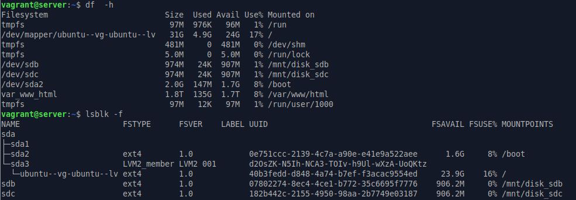
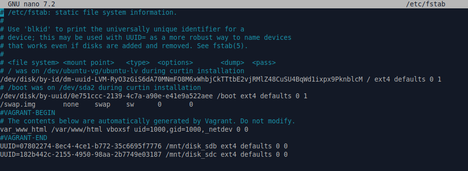
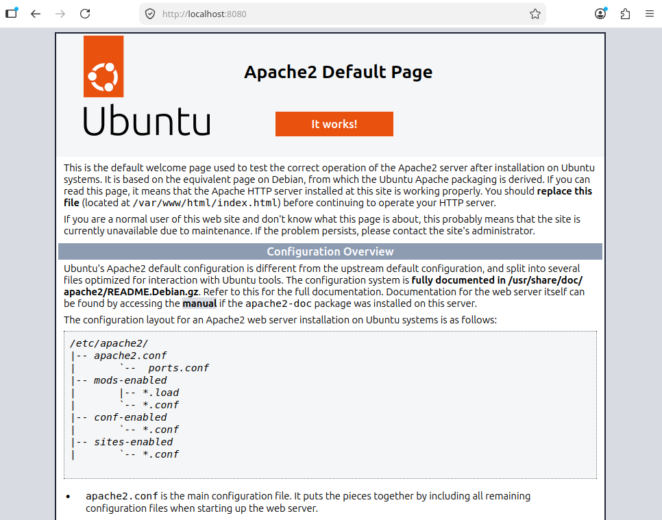

# ДЗ № 13
## Тема: "Vagrant"
Задание: 
1. Подготовить окружение:
	- cоздать базовую виртуальную машину (можно имспользовать любую базовую VM);
	- настроить память VM: 1024 МБ;
	- добавить 2 виртуальных диска (по 1 ГБ каждый);
	- настрить проброс 80 порта с VM системы на порт 8080 хостовой системы.
2. Написать провижининг, который:
	- форматирует добавленные диски в файловую систему ext4;
	- создает для указанных дисков 2 точки монтирования в директории (директория /mnt/);
	- монтирует диски в указанные директории;
	- добавляет записи в /etc/fstab для автоматического монтирования дисков при загрузке.

## Выполнение задания
Пояснения: 
- базовая VM: ubuntu 24.04; 
- на VM через Ansible поднимается Apache2 (порт: 80); 
- директории для монтирования дисков на VM: /mnt/"некущее имя дика (блочного устройства)" (например, sdb); 
- провижинг выполняем через Ansible (в этом есть как плюсы, так имнусы). 

Vagrant: 
- конфигурационный файл [Vagrantfile](./files/Vagrant) 
  
Ansible (файлы-сценарии должны лежать в директории ./Provisioning относительно файла Vagrantfile):
- основной сценарий [playbook.yml](./files/playbook.yml)
- сценарий настройки конкретного диска [disk_prepare.yml](./files/disk_prepare.yml) \
(основной сценарий - playbook.yml, запускает disk_prepare.yml только для дисков размером 1 GB, не имеющих UUID)

## Результаты задания
После отработки Vagrantfile проводим ряд тестов: \
На VM: \
 \
 \
На хосте: \
 \
 \

Все работает.	
