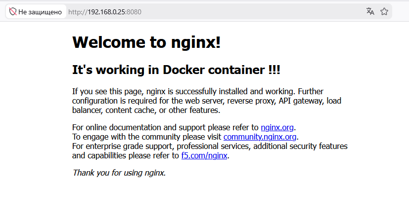

# ДЗ № 14
## Тема: "Docker"
Задание: 
- Установите Docker на хост машину.
- Создайте свой кастомный образ nginx на базе alpine. \
	После запуска nginx должен отдавать кастомную страницу (достаточно изменить дефолтную страницу nginx).
- Определите разницу между контейнером и образом. Ответьте на вопрос: Можно ли в контейнере собрать ядро?

## Выполнение задания
На базе общедоступного образа с nginx (alpine) был создан свой docker image \
Конфигурационный файл для сборки: [Dockerfile](./Files/Dockerfile) \
Подредактированная страница: [index.html](./Files/index.html) 

Загрузить мой docker image можно с Docker Hub
```
docker pull barmaley75/my-nginx:1.0.0
```

После запуска докера из этого образа и обращения браузером к работающему в нем WEB серверу (Nginx) отображается страница:
 \
Bce работает.

