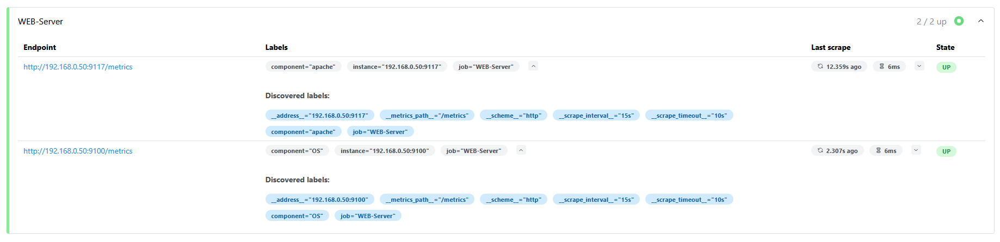
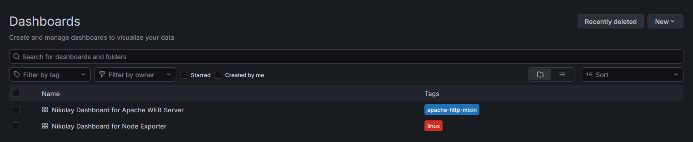
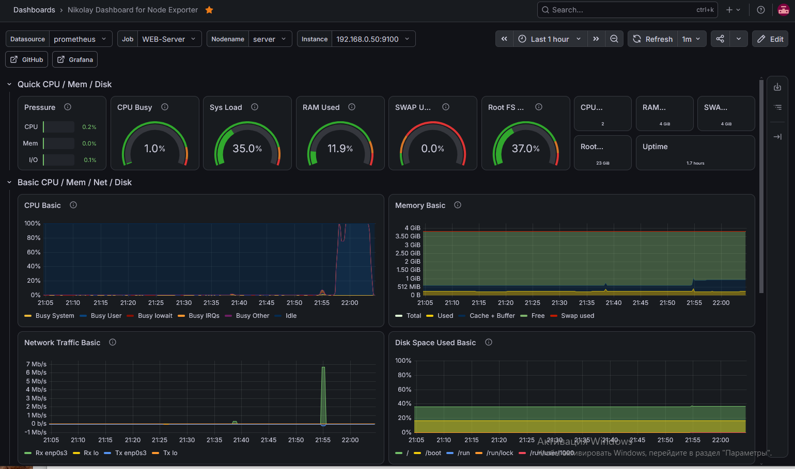
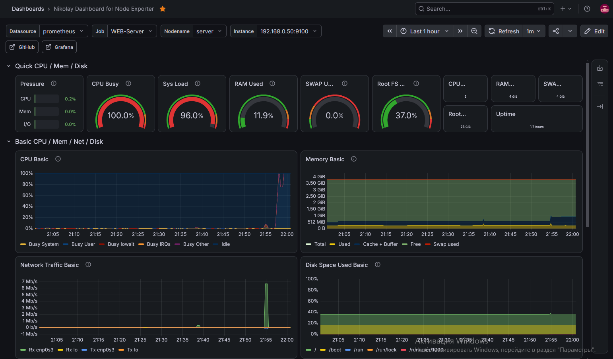
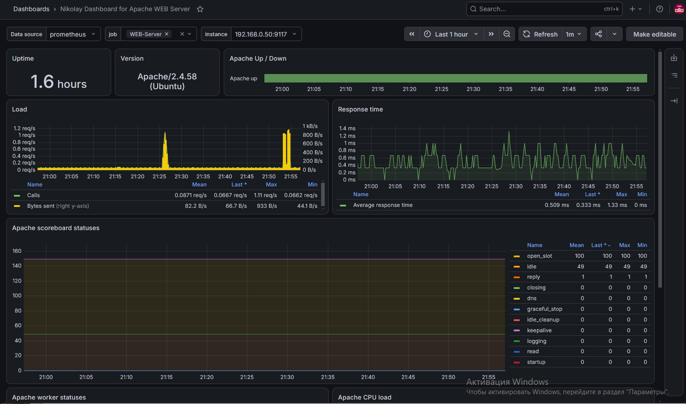

# ДЗ № 15
## Тема: "Prometheus"
Задание: 
Настроить дашборд с 4-мя графиками: память, процессор, диск, сеть.

## Выполнение задания
Развернуты две VM на Ubuntu server 24.04:
- Prometheus Server (192.168.0.25) c Prometheus и Grafana
- WEB Server (192.169.0.50) c Apache 2 и node_exporter-1.10.2, apache_exporter-1.1.1

После настройки в Prometheus имеем следующие истоники (exporters) \
 \

В Grafana созданы (экспорированы) два дашборда (ID: 1860 и 20465) \
 \

Дашбоард под node_exporter (VM без нагрузки) \
 \

Дашбоард под node_exporter (на VM пашет stress_ng) \
 \

Дашбоард под apache_exporter \
 \

Все работает.
