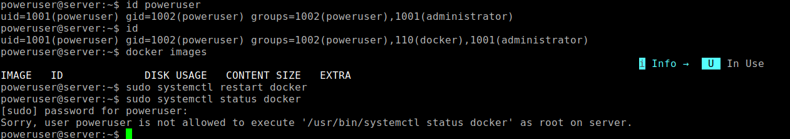

# ДЗ № 16
## Тема: "PAM"
Задание: 
- На VM ограничить доступ к системе для всех пользователей, кроме группы администраторов, в суббота и воскресенье.
- Предоставить определённому пользователю доступ к Docker и право перезапускать Docker-сервис.

## Выполнение задания
На MV создаются три пользователя:
- poweruser (pwd: poweruser)
- alex (pwd: alex)
- gary (pwd: gary)
Также создается группа administrator и в нее включается poweruser

Для решения первой задачи изпользуется PAM, соответствующие правила прописываются в:
- /etc/security/time.conf
- /etc/pam.d/common-account

Для частичного решения второй задачи также извользуется PAM (даем возможность poweruser работать с программой docker)
Пользователю poweruser динамически прописывсаем группы docker. Соответствующие правила заносим в:
- /etc/security/group.conf
- /etc/pam.d/common-auth

Дать возмозность poweruser в произвольное время (не тольно при запуске сессии) \
перезапускать службу docker (systemctl restart docker) чере PAM не получается \
По этому делаю это через правила /etc/sudoers \
Пользователь сможет выполнять sudo systemctl restart/start/stop docker без ввода пароля \

Тестовая VM автоматически настраивается с помощью Vagrant. Конфигурационный файл [Vagrantfile](./Files/Vagrantfile) \
и bash скрипта [pam-config.sh](./Files/pam-config.sh). Скрипт запускается автоматом с помощью Vagrant provision.

Результаты теста второй части \
 \
Все работает.

