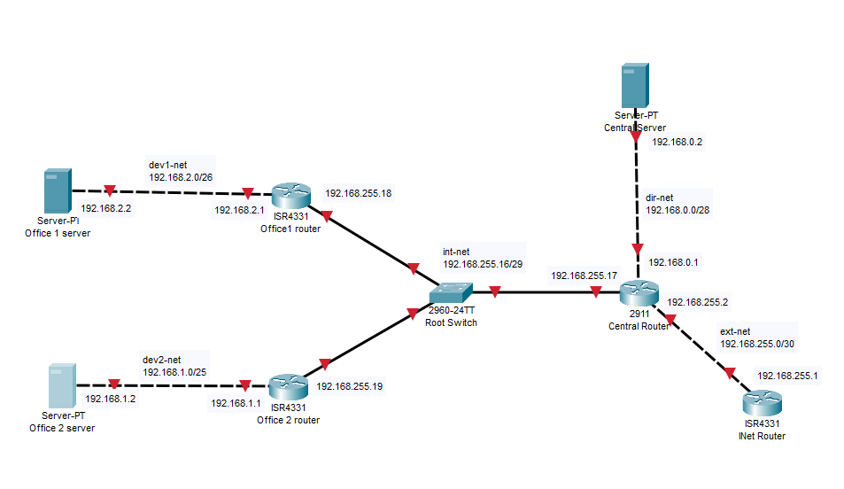
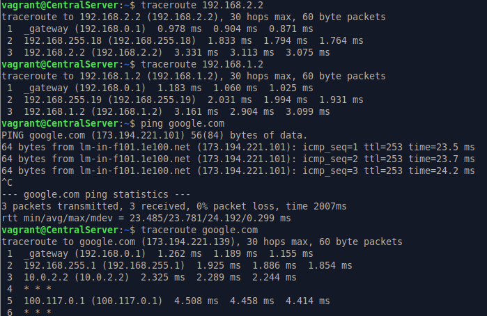
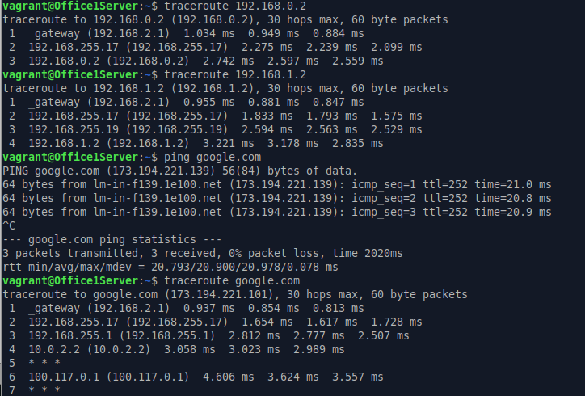
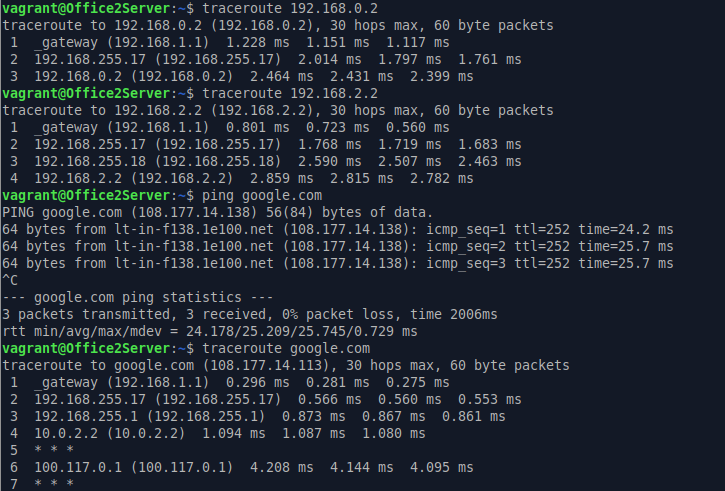

# ДЗ № 19
## Тема: "Архитектура сетей "
Задание: 
Построить следующую архитектуру:
1. Сеть office1
    + 192.168.2.0/26 - dev
    + 192.168.2.64/26 - test servers
    + 192.168.2.128/26 - managers
    + 192.168.2.192/26 - office hardware

2. Сеть office2
    + 192.168.1.0/25 - dev
    + 192.168.1.128/26 - test servers
    + 192.168.1.192/26 - office hardware

3. Сеть central
    + 192.168.0.0/28 - directors
    + 192.168.0.32/28 - office hardware
    + 192.168.0.64/26 - wifi

```
Office1 ---\
            -----> Central ---> INetRouter --> Internet 
Office2----/
```
Итого должны получится следующие сервера:
- inetRouter
- centralRouter
- office1Router
- office2Router
- centralServer
- office1Server
- office2Server

Теоретическая часть:
- найти свободные подсети
- посчитать сколько узлов в каждой подсети, включая свободные
- указать broadcast адрес для каждой подсети
- проверить нет ли ошибок при разбиении

Практическая часть:
- соединить офисы в сеть согласно схеме и настроить роутинг
- все сервера и роутеры должны ходить в инет черз inetRouter
- все сервера должны видеть друг друга
- у всех новых серверов отключить дефолт на нат (eth0), который вагрант поднимает для связи
(при нехватке сетевых интервейсов добавить по несколько адресов на интерфейс)

## Выполнение задания
### Теоретическая часть:

Сеть Central
  + 192.168.0.0/28 - directors, netmask: 255.255.255.240, broadcast: 192.168.0.15, total hosts: 14, IP range: 1 - 14
  + 192.168.0.32/28 - office hardware, netmask: 255.255.255.240, broadcast: 192.168.0.47, total hosts: 14, IP range: 33 - 46
  + 192.168.0.64/26 - wifi, netmask: 255.255.255.192, broadcast: 192.168.0.127, total hosts: 62, IP range: 65 - 126 \
  Можно допольнительно сделать подсети:
    + 192.168.0.16/28 - netmask: 255.255.255.240, broadcast: 192.168.0.31, total hosts: 14, IP range: 17 - 30
    + 192.168.0.48/28 - netmask: 255.255.255.240, broadcast: 192.168.0.63, total hosts: 14, IP range: 49 - 62
    + 192.168.2.128/25 - netmask: 255.255.255.240, broadcast: 192.168.0.127, total hosts: 126, IP range: 129 - 254

Сеть Office1
  + 192.168.2.0/26 - dev, netmask: 255.255.255.192, broadcast: 192.168.2.63, total hosts: 62, IP range: 1 - 62
  + 192.168.2.64/26 - test servers, netmask: 255.255.255.192, broadcast: 192.168.2.127, total hosts: 62, IP range: 65 - 126
  + 192.168.2.128/26 - managers, netmask: 255.255.255.192, broadcast: 192.168.2.191, total hosts: 62, IP range: 129 - 190
  + 192.168.2.192/26 - office hardware, netmask: 255.255.255.192, broadcast: 192.168.2.255, total hosts: 62, IP range: 193 - 254

Сеть Office2
  + 192.168.1.0/25 - dev, netmask: 255.255.255.128, broadcast: 192.168.1.127, total hosts: 126, IP range: 1 - 126
  + 192.168.1.128/26 - test servers, netmask: 255.255.255.192, broadcast: 192.168.1.191, total hosts: 62, IP range: 129 - 190
  + 192.168.1.192/26 - office hardware, netmask: 255.255.255.192, broadcast: 192.168.1.255, total hosts: 62, IP range: 193 - 254

Существенных ошибок нет, будет работать. \
Не совсем понятно почему в офисе №1 - 192.168.2.0, а в офисе №2 - 192.168.1.0, но на скорость это не влияет :)

### Практическая часть:
Если я правильно понял схему в задании, то нужно построить макет офисной сети со следующей топологией.\
 

Для решения этой задачи подготовлены:
1. [Vagrant](./Files/Vagrantfile) - конфигурационный файл Vagrant, поднимает все необходимые VM на ОС Ubuntu 24.04 и приватные сети, \
а также производит требующися настройки.
2. [playbook.yml](./Files/playbook.yml) - сценарий Ansible, должен лежать в ./Provisioning относительно Vagrant, фактически используется только \
для установки на сетвера утилиты traceroute (использовалась для тестирования стенда)

Результаты тестированяи стенда:

CentralServer \
 

Office1Server \


Office2Server\
 

Все работает.  

 
