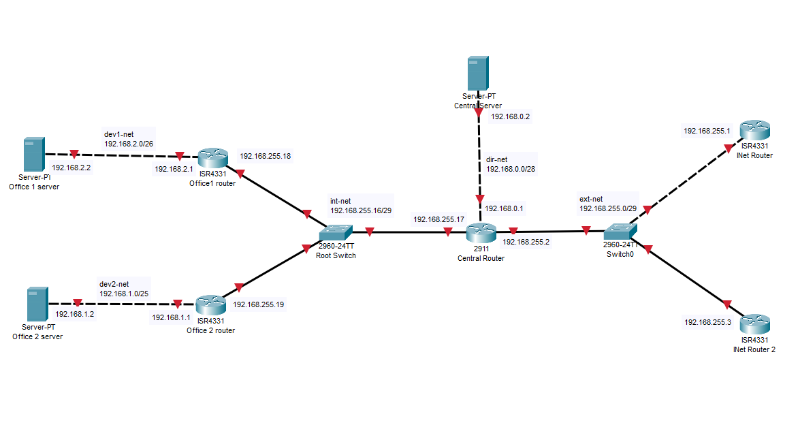
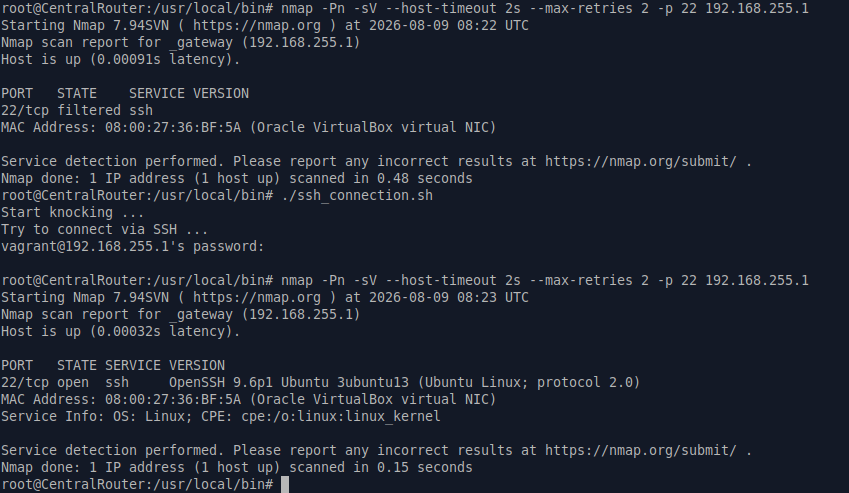
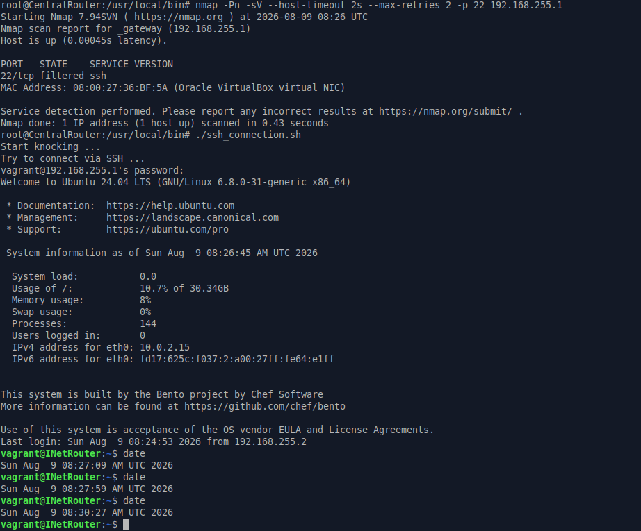
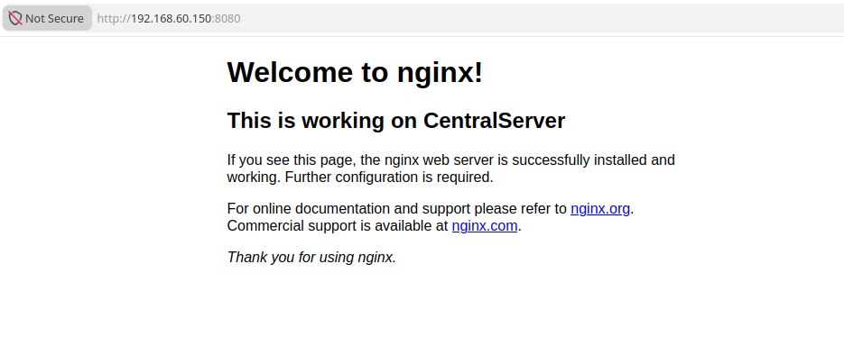
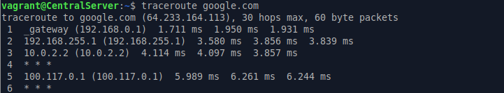

# ДЗ № 21
## Тема: "Сценарии iptables"
Задание: 
1. Pеализовать knocking port (centralRouter может попасть на ssh inetrRouter через knock).
2. Добавить inetRouter2, который виден (маршрутизируется (host-only тип сети для виртуалки)) с хоста или форвардится порт через локалхост.
3. Запустить nginx на centralServer, пробросить его 80й порт на inetRouter2 8080.
4. Дефолт в инет оставить через inetRouter.

## Выполнение задания
Берем стенд сделанный при выполнении [DZ-19](https://github.com/Nikolay-765/OTUS/blob/main/DZ-19/DZ-19.md) \
Вносим к него необходимые правки.
В результате имеем:
1. [Vagrant](./Files/Vagrantfile) - конфигурационный файл Vagrant, поднимает все необходимые VM на ОС Ubuntu 24.04 и приватные сети, \
а также производит требующися настройки.
2. [ssh_connection.sh](./Files/ssh_connection.sh) - bash скрипт для подключение по SSH к INetRouter с открытием 22 порта с помощью port knocking \
(ключевая последовательность портов: 9682, 7225, 4036, 8113), должены лежать в ./Provisioning относительно Vagrant.
3. [server.yml](./Files/server.yml), [centralserver.yml](./Files/centralserver.yml), [centralrouter.yml](./Files/centralrouter.yml) - сценарии Ansible,\
должны лежать в ./Provisioning относительно Vagrant, используется для установки различного софта на VM, в том числе Nginx на CentralServer, \
а также и загрузки ssh_connection.sh на CentralRouter (/usr/local/bin).

Получился макет сети со следующей топологией.\
 \
Важно: INetRouter2 и хостовая ОС связаны с помощью сети типа host-only (192.168.60.0/24). IP адрес INetRouter2 в этой сети 192.168.60.150 

##Результаты тестированяи:

Находимся на CentralRouter \
Пытаемся с помощью nmap сканировать 22 порт на INetRouter, ничего не выходит. \
Запускаем скрипт ssh_connection.sh, но к INetRouter не подключаемся (Ctrl+C). \
Вновь сканируем 22 порт на INetRouter, порт открыт считываем информацию по SSH серверу. \
 

С помощью скрипта ssh_connection.sh заходим на INetRouter и видим, что соединение живет более 60 секунд (таймаут на подключения после правильного knocking'а). Уже открытая сессия не прерывается. \

С хоста браузером обращаемся на 8080 порт INetRouter2 (192.168.60.150:8080). \
Попадаем на WEB-сермер, работающий на CentralServer \
 

При этом в Internet CentralServer ходит через INetRouter \
 

Все работает.  

 

