# ДЗ № 22
## Тема: "OSPF"
Задание:
1. Поднять три виртуалки
2. Объединить их разными vlan
3. Поднять OSPF между машинами на базе Quagga;
4. Изобразить ассиметричный роутинг;
5. Сделать один из линков "дорогим", но что бы при этом роутинг был симметричным.

## Выполнение задания
Для решения задния подготовлены:
1. [Vagrant](./Files/Vagrantfile) - конфигурационный файл Vagrant, поднимает все необходимые VM на ОС Ubuntu 24.04 и приватные сети, \
а также производит требующися настройки.
2. [router.yml](./Files/router.yml), [office.yml](./Files/office.yml) - сценарии Ansible, настраивающие соотвествующие VM, \
долженs лежать в ./Provisioning относительно Vagrant
3. [Router1.conf](./Files/Router1.conf), [Router2.conf](./Files/Router2.conf), [Router2.conf](./Files/Router2.conf) - конфигурационные файлы  \
/etc/frr/frr.conf для VM Router1, Router2, Router3 соответственно, должны лежать в ./FRR_conf относительно Vagrant, \
копируются в VM с помощью ansible сценария router.yml.

Получился макет сети со следующей топологией.\
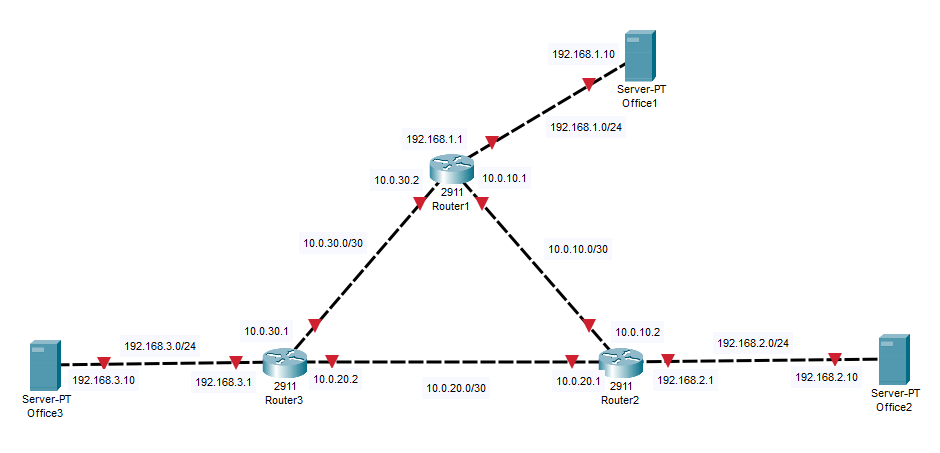 \
На интерфейсах, соединящищих между собой Router1, Router2, Router3 изначальон установлено ip ospf cost = 10

Проверяем работоспособность стенда \
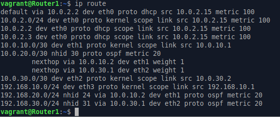 
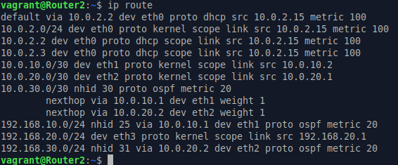 
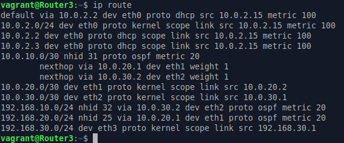 
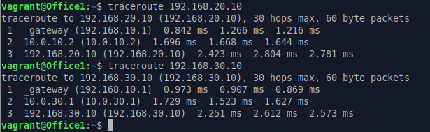
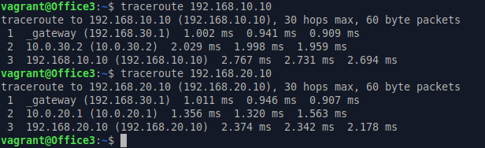
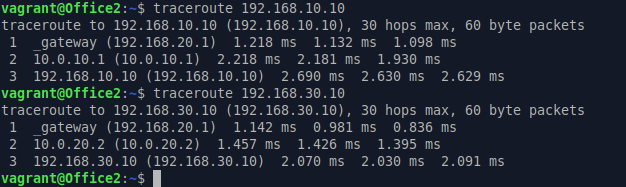

Делаем ассиметричный роутинг. Для этого в VM Router1 интерфейсу 10.0.10.1 увелисиваем вес (ip ospf cost = 100). \
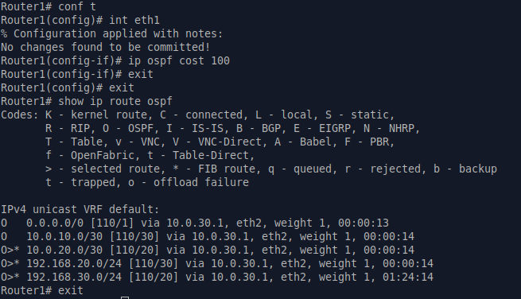 \
На VM Office1 запускаем ping 192.168.20.10 (VM Office2). \
На VM Router2 применительно к eth1, eth2 запускаем tcpdump и смотрим что вышло. \
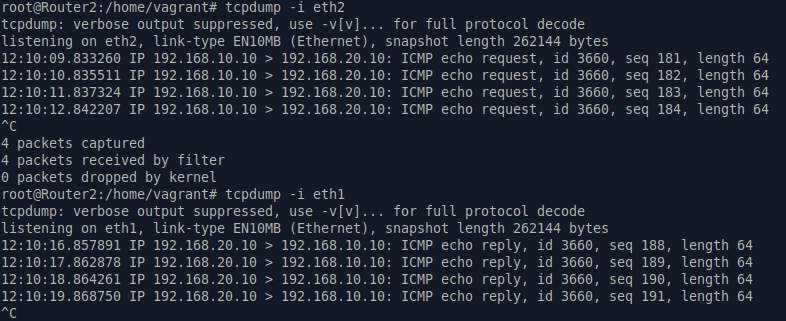

Делаем один из линков "дорогим" с обеспечением симетричного роутинга. \
Для этого в VM Router2 интерфейсу 10.0.10.2 увелисиваем вес (ip ospf cost = 100). \
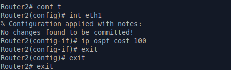 \
Вновь на VM Office1 запускаем ping 192.168.20.10 (VM Office2) \
На VM Router2 с помощью tcpdump смотрим трафик на eth1 и eth2 \
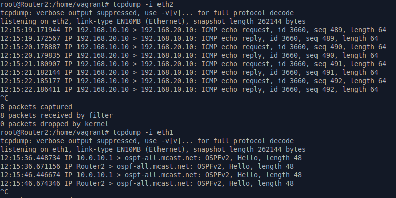 \
На всякий слуxай смотрим трассировку \
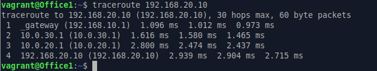 \

Все работает.  

 

