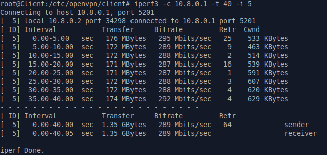
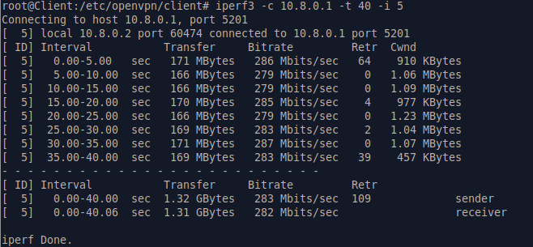
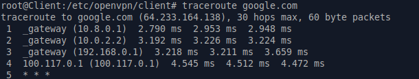

# ДЗ № 23
## Тема: "OVPN"
Задание:
1. Настроить VPN между двумя ВМ в tun/tap режимах, замерить скорость в туннелях, сделать вывод об отличающихся показателях
2. Поднять RAS на базе OpenVPN с клиентскими сертификатами, подключиться с локальной машины на ВМ

## Выполнение задания
### Часть первая
Для решения этой части задния подготовлены:
1. Конфигурационный файл Vagrant, поднимает две VM на ОС Ubuntu 22.04 и приватнию сеть между ними.
2. Настраивающие VM сценарии Ansible server.yml и client.yml, должены лежать в ./Provisioning относительно Vagrant
3. Настраивающий VM bash скрипт ovpn-conf.sh, должн лежать в ./Script относительно Vagrant \
Указанные файлы находятся в архиве [OVPN-PSK.tar.gz](./Files/OVPN-PSK.tar.gz) \
Важно: режим работы виртуальных интерфейсов OVPN (TUN или TAP) отределятся переменной DEV_Type в скрипте ovpn-conf.sh (инначально это tun)

После vagrant up bмеем стенд из двух VM Server - 192.168.50.1 и Client - 192.168.50.10, связанные приватной сетью 192.168.50.0/24 \
На обоих VM все подготовленно для поднятия OVPN с симетричным шифрованием. \
На VM Server автоматом запускаются openvpn server (как служба) IP: 10.8.0.1 и iperf3 в серверном режиме.

Идем на VM Client \
Переходим в дирректорию /etc/openvpn/client и делаем sudo su \
Далее запускаем openvpn (интерфейс в режиме tun) и замеряем пропускную способность сформированного VPN канала 
```
openvpn --config client.conf --daemon
iperf3 -c 10.10.10.1 -t 40 -i 5 
```
В результате получаем \


Тормозим VPN
```
killall openvpn
```
В скрипте ovpn-conf.sh меняем значение DEV_Type на tap и делаем vagrant provision \
Вновь на VM Client запускаем openvpn и замеряем пропускную способность сформированного VPN канала \
 

Видим, что когда виртуальные интерфейсы openvpn в функционируют режиме TUN полезная пропускная способность поднятого VPN-канала \
несколько выше, чем при их работе в режиме TAP. \
Это обясняется следующими факторами:
1. При TAP эмулируется реальный коммутатор (L2) и часть пропускной способности канала съедается служетным трафиком. В режиме TUN (L3) этого нет.
2. В режиме TUN в паметах транслируется только только IP-заголовки. В TAP необходимо в пакетах дополнительно пердавать Ethernet-заголовки,
в результате объем полезной нагрузки в них уменьшается.

### Часть вторая
Для решения подготовлен второй стенд (архив [OVPN-RSA.tar.gz](./Files/OVPN-RSA.tar.gz)) \
На стенде все готово для поднятия OVPN с симетричным шифрованием между VM Server и Client через связыавющую их приватую сеть \
На VM Server автоматом запускается openvpn server (как служба) IP: 10.8.0.1 с возможностью выхода в Интернет через хост 10.0.2.2 \
Виртуальные интерфейсы работают в режите TUN

Идем на VM Client \
Переходим в дирректорию /etc/openvpn/client и делаем sudo su \
Запускаем openvpn и проверяем работоспособность канала, а также возможность выхода через него в Интеренет. 
```
openvpn --config user.conf --daemon
traceroute google.com
```
Видим следующее  \
 

Все работает.  

 


