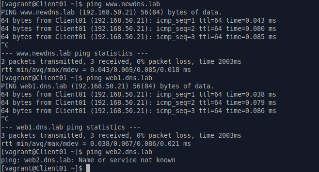
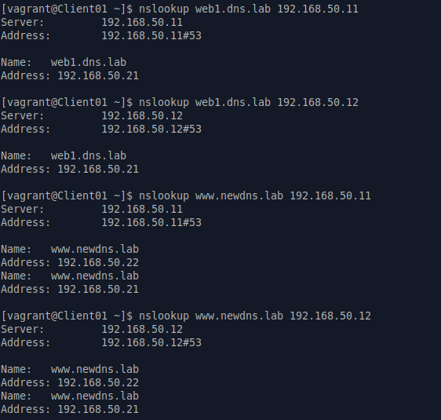
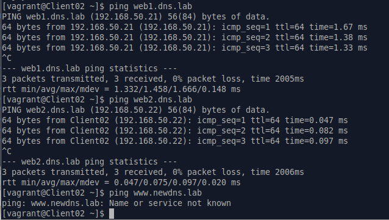
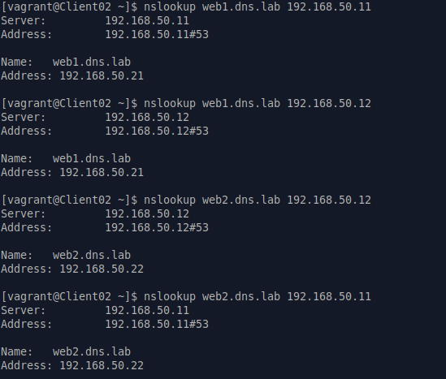

# ДЗ № 24
## Тема: "DNS"
Задание:
1. Взять стенд https://github.com/erlong15/vagrant-bind
2. Добавить еще один сервер client2
3. Завести в зоне dns.lab имена: web1 - смотрит на клиент1, web2 - смотрит на клиент2
4. Завести еще одну зону newdns.lab и сделать в ней запись www - смотрит на обоих клиентов
5. Настроить split-dns 
- клиент1 - видит обе зоны, но в зоне dns.lab только web1
- клиент2 - видит только dns.lab

## Выполнение задания
На базе прендоженного стенда подготовлен свой вариат [DNS.tar.gz](./Files/DNS.tar.gz), \
в котором решены все задачи ДЗ. \
Данный стенд включает 4 VM на OC Almalinux 9:
- NS01 (master, IP 192.168.50.11)
- NS02 (slave, IP 192.168.50.12)
- Client01 (IP 192.168.50.21)
- Client02 (IP 192.168.50.22)

Тестируем как подготовленный стенд: \
Заходим на Client01. C помощью nslookup и ping смотрим как работают NS.

Заходим на Client02.

Все работает.  

 

