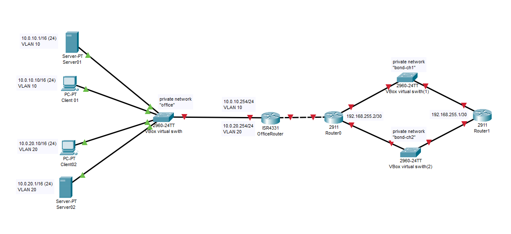
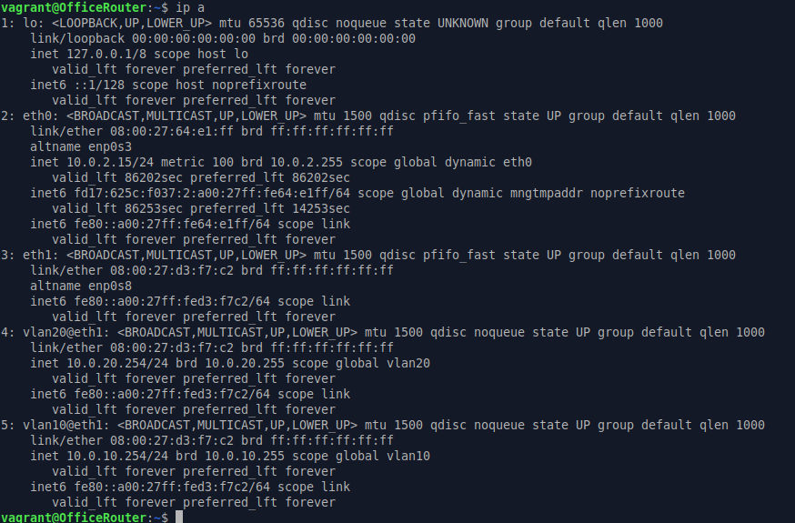
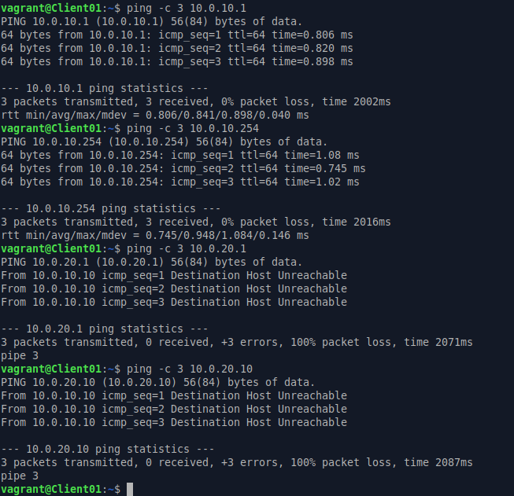
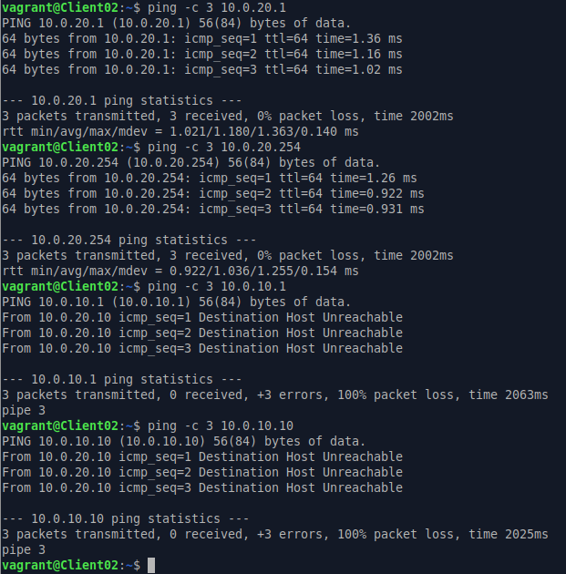
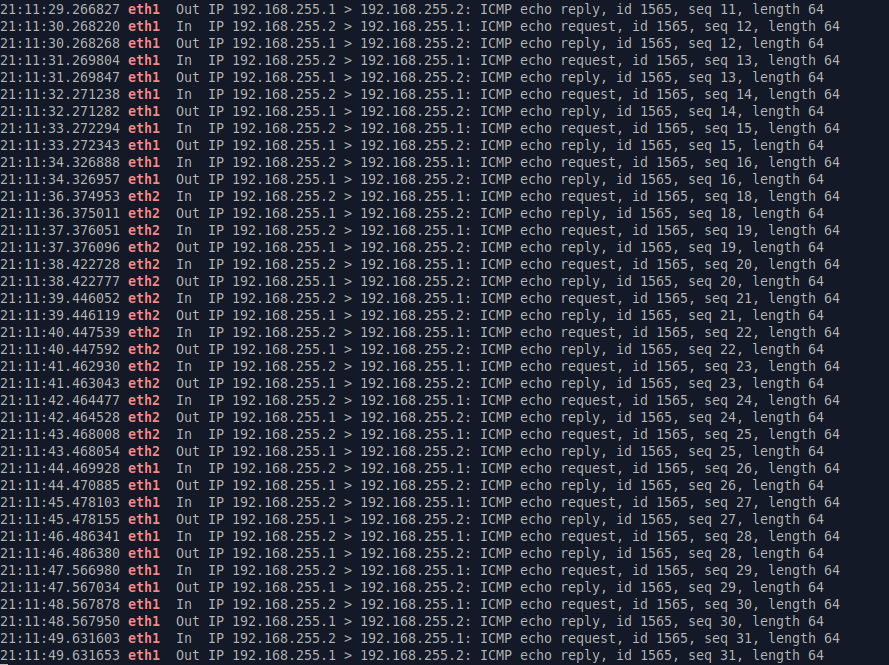

# ДЗ № 25
## Тема: "VLAN и LACP"
Задание:
1. в Office в тестовой подсети появляется сервера с доп интерфейсами и адресами
в internal сети testLAN:

testClient1 - 10.10.10.254
testClient2 - 10.10.10.254
testServer1- 10.10.10.1
testServer2- 10.10.10.1
Развести вланами:
testClient1 <-> testServer1
testClient2 <-> testServer2

2. Между centralRouter и inetRouter "пробросить" 2 линка (общая inernal сеть) и объединить их в бонд, проверить работу c отключением интерфейсов

## Выполнение задания
В рамказх ДЗ подготовлены:
1. [Vagrant](./Files/Vagrantfile) - конфигурационный файл Vagrant, поднимает все необходимые VM на ОС Ubuntu 24.04 и приватные сети, \
а также производит требующиеся настройки.
2. [bonding.yml](./Files/bonding.yml), [office-router.yml](./Files/office-router.yml), [office.yml](./Files/office.yml) - сценарии Ansible, \
настраивающие соответствующие VM, долженs лежать в ./Provisioning относительно Vagrant

Получился макет сети со следующей топологией.\
Названия VM и IP-шники немного изменил, надеюсь это не смертельно.\
Показал присутствие виртуальных свичей Vbox, т.к. это важно по 2-й части задания.
 \

## 1-я часть задания
Сетевые интерфейсы Client01, Client02, Server01, Server02 и один интерфейс OfficeRouter (eth1) подключены к приватной сети "office" \
Client01, Server01, OfficeRouter (первый виртуальный интерфейс на eth1) смотрят во VLAN 10 \
Client02, Server02, OfficeRouter (второй виртуальный интерфейс на eth1) смотрят во VLAN 20 \
Настройка интерфейсов OfficeRouter \
 \

Для тестирования допущена "ошибка" - на интерфейсах Client01, Client02, Server01, Server02 установлена маска 16 в место 24 \
В настоящее время указанные интерфейсы находятся в одной подсети и если они были бы VLAN'ов не было, то они бы \
между собой пинговались. Проверяем это \
 


Все ОК, вланы работают.

## 2-я часть задания
Два линка между CentralRouter и INetRouter объеденяем в bond типа active-backup с ARP-мониторингом. \
Сделать bond типа active-backup без ARP-мониторинга не получится т.к. буде мешать виртуальный комутатор. \
Если накрывается один из каналов между первой VM и виртуальным коммутатором, то вторая VM об этом не узнает, \
так как с каналами между ней и виртуальныv коммутатором все по прежнему будет хорошо и соотвественно переключения \
на резервный канал не будет.

Проверяем работоспособность bond канала
На INetRouter запускаем мониториг ICMP пакетов
```
tcpdump -l -n -i any "icmp and (inbound or outbound)" | grep -E "eth1|eth2"
```
C CentralRouter пингует INetRouter \
Параллельно с другого терминала на CentralRouter тушим и поднимаем задействуемые в бондинге интерфейсы.
```
ip link set eth1 down
ip link set eth1 up
```
Видим автоматическое переключение используемых каналов. \
Пример того, что наблюдается на INetRouter \


Все работает.

