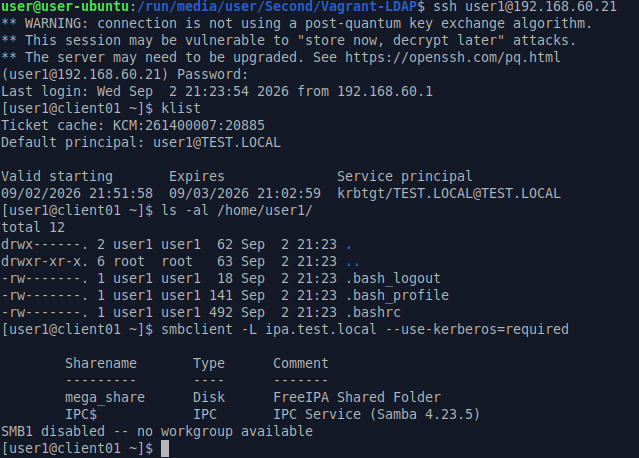
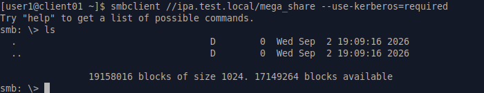
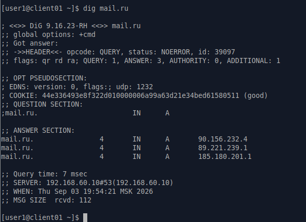
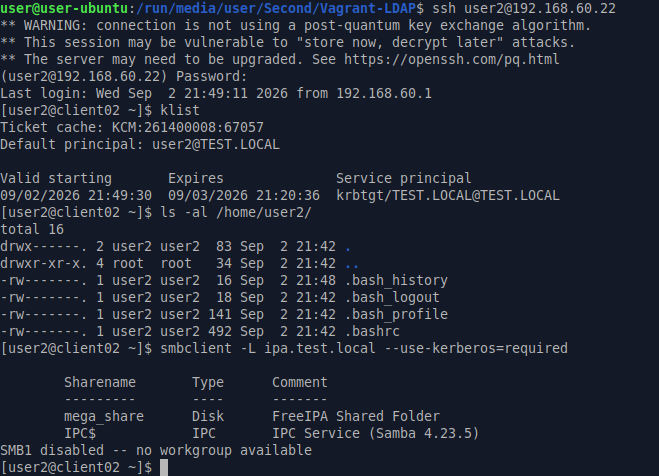
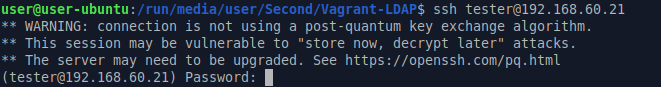
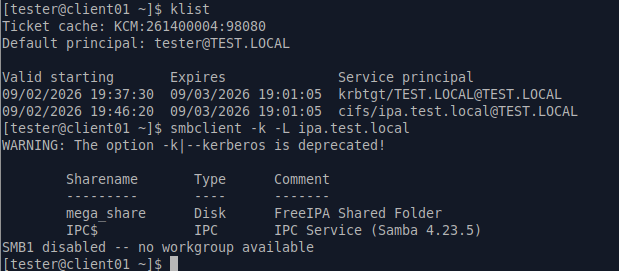
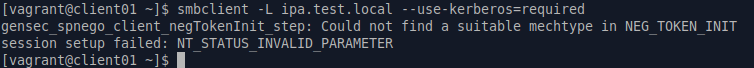

# ДЗ № 26
## Тема: "LDAP"
Задание:
1. Установить FreeIPA
2. Написать Ansible-playbook для конфигурации клиента
Дополнительное задание:
3.* Настроить аутентификацию по SSH-ключам
4.** Firewall должен быть включен на сервере и на клиенте

## Выполнение задания
В рамках ДЗ подготовлен стенд, автоматически разварачивающийся с помощью vagrant и ansible
1. Конфигурационный файл Vagrant, поднимает три VM на ОС Almalinux 9 server (сервер и 2 клиента) и настраимает между ними виртуальную сеть типа hostonly 
2. Настраивающие VM сценарии Ansible ipa.yml и client.yml, должены лежать в ./Provisioning относительно Vagrant 

Стенд включает: \
VM IPA - контроллер домена test.local (IP: 192.168.60.10), дополнительно на нем также подняты: 
   - DNS сервер c форвардингом запросов на 1.1.1.1 и 8.8.8.8 
   - интегрированный в домен файлообменный сервер на базе samba (доступ к данным на шаре у пользователя есть, если он в группе shareusers) 

VM Client01 и Client02 - автоматически вводятся в домен 

В стенде автоматически создаются два тестовых пользователя: user1 и user2 (IP: 192.168.60.21, 192.168.60.22, имеют доступ к шаре). \
Имеется возможность создания дополнительных пользователей через web панель управления freeipa (IP: 192.168.60.10) \
На контроллере домена и клиентах установлен и настроен fierwalld (виртуальная сеть связывающая VM выделена в отдельную зону domain) \
В Almalinux 9 server из коробки уже настроена синхрония времени (на базе chrony), по этому здесь ничего делать не пришлось. 

Проверяем, что получилось. \
С хостовой машины по SSH заходим на VM Client01 под пользователем user1, проверяем, что ему выдан билет kerberos, \
создалась его рабочая директория и ему доступна шара. \
 \
 \
Проверяем, что DNS запросы идут через DNS сервер, работающий на контроллере домена \
 \
Заходим на VM Client02 под пользователем user2 и и выполняем аналогичную проверку \
 \
 \
Создаем пользователя tester через web панель управления freeipa и включаем его в группу shareusers. \
Под новым пользователем заходим по SSH на VM Client01 и делаем провепку. \
 \
На всекий случай проверяем, что посторонниму шара не доступна, напрпиме пользователю vagrant \


Аутентификацию по SSH ключам делал руками, в стенд ее не включил. \
На VM IPA (конттролле домена) от root генерим пару ключей и в домене прописываем публичный ключ в качестве \ 
средства аутентификации для заданного пользователя (например, user1)
```
ssh-keygen -t ed25519 -f /root/.ssh/id_user1
kinit admin
ipa user-mod user1 --sshpubkey="$(cat /root/.ssh/id_user1.pub)"
```
Достаем из /root/.ssh приватный ключ id_user1 \
Теперь с помощью данного ключа на любом клиенте можно зайти под пользователем user1 без ввода пароля
```
ssh -i id_user1 user1@192.168.60.21
```
Но при это билет kerberos данному пользователю автоматом выписываться не будет. \
Следовательно для доступа к шаре пользователю потребуется пройти аутенификацию и ввести пароль.
```
kinit user1
```

Стенд работает, ДЗ выполнено.

В ДЗ наличие DNS не предполагается. Вместе с тем, в одном касающемся именно DNS сервера ходелось бы разобраться. \
Сейчас для работы DNS сервера в его настройках пришлось отключить проверку цифровых подписей DNSSEC \
(служба: namedб опция: dnssec-validation no). \
Если указанная проверка включена, то стару после развертывания стенда все OK, однако после перезагрузки VM IPA, форвардинг DNS запросов к внешним DNS серверам перестает работать.
Служба named работает, ошибок нет, запросы по локальным url например, ipa.test.local резолвятся. При этом со временем на VM все хорошо.
Лечится отключением проверки DNSSEC и перезагрузкой named. Но это костыль. \
Возможно проблема связана с особенностями автоматической конфигурацией сетей в vagrant (что происходит каждый раз при загрузке, яркий пример /etc/NetworkManager/system-connections/eth1.nmconnection)
При первом запуске VM и установке на нее DNS сервера (ipa-server-dns) все настройки прописываются правельно, но после перезагрузки vagrant в них корежит.
Самостоятельно разобраться в этом у меня не получилось, если подскажете в чем именно проблема и как ее решить будет здорово.
Заранее благодарен.


 


