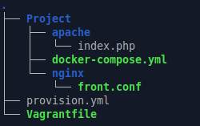
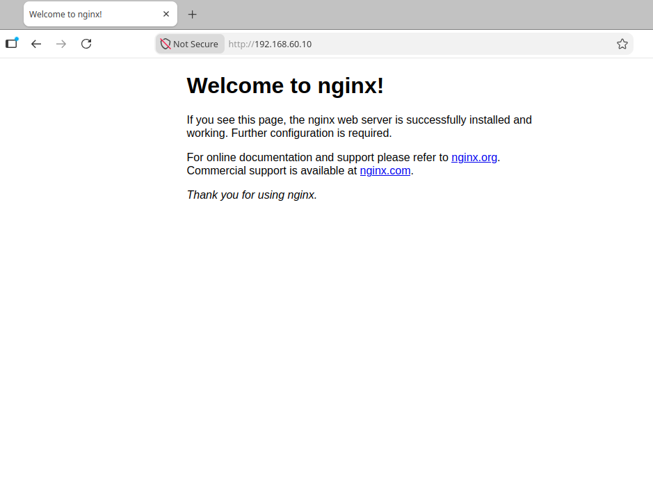
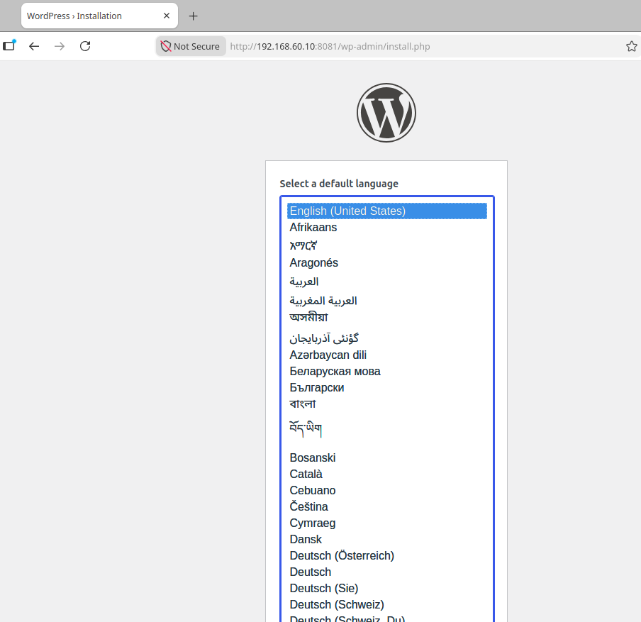
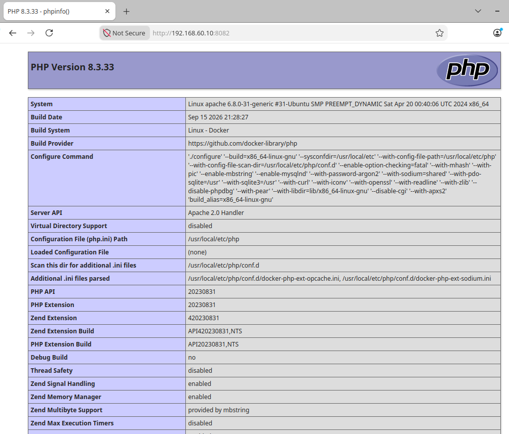
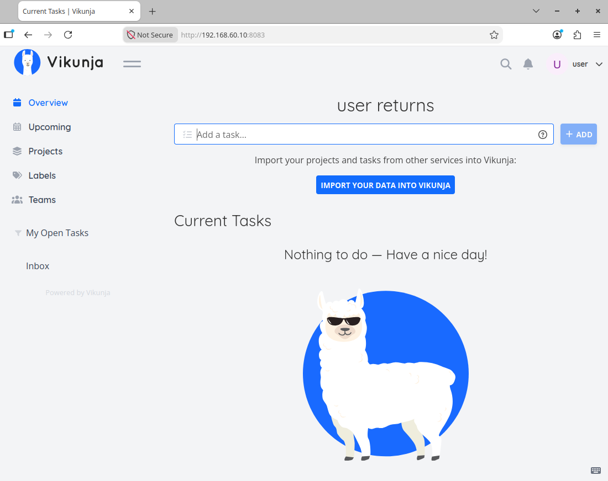

# ДЗ № 27
## Тема: "Развертывание веб приложения"
Задание: \
Сделать стенд и развернуть на нем 3 web приложнения.

Варианты стенда: \
nginx + php-fpm (laravel/wordpress) + python (flask/django) + js(react/angular); \
nginx + java (tomcat/jetty/netty) + go + ruby; \
можно свои комбинации.

Реализации на выбор: \
на хостовой системе через конфиги в /etc; \
деплой через docker-compose.

К сдаче принимается: \
vagrant стэнд с проброшенными на локалхост портами \
каждый порт на свой сайт через нжинкс

## Выполнение задания
В рамках ДЗ подготовлен стенд, автоматически разварачивающийся с помощью vagrant и ansible
1. Vagrantfile - конфигурационный файл vagrant, поднимает VM на ОС Ubuntu 24.04 server, IP: 192.168.60.10 (сеть hostonly) 
2. provision.yml - сценарий Ansible, настраивает VM, в том числе:
 - локальнго на VM устанавливает и настраивает nginx (конфиг front.conf)
 - устанавливает и запускает на docker compose, который в соотвествии с docker-compose.yml настраивает и запускает на VM контейнеры с WEB приложениями

Файлы стенда: [dunamic_web.tar.gz](./Files/dunamic_web.tar.gz) 

Структура стенда \
 

После того как VM автоматически развернется и настроится, на ней будут крутиться: 
- nginx, выполняет роль front servera (proxy)
- wordpress, backend, доступен через nginx на порту 8081 (локально по 9000), используется протокол FastCGI (в отдельном контейнере крутится DB mysql)
- apache2, backend, доступен через nginx на порту 8082 (локально по 1082), простое проксирование
- vikunja, backend, доступена через nginx на порту 8083 (локально по 1083), проксирование с поддержной WebSockets, что необходимо для ее работы (в отдельном контейнере крутится DB postgres)

## Проверяем как стенд работает: 
Браузером с хостовой ПЭВМ обращаемся на VM (порт 80, по умолчанию), отзывается nginx \
 

Обращаемся на VM (по порту 8081), видим работу wordpress \
 

Обращаемся на VM (по порту 8082), видим конфигурацию php на apache \
 

Обращаемся на VM (по порту 8083), видим web-морду vikunja \
 

Все работает
