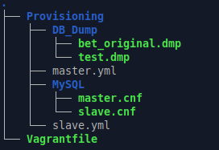

# ДЗ № 28
## Тема: "MySQL репликация"
Задание: \
В материалах приложена ссылка дамп базы bet.dmp \
Нужно развернуть базу на master'е и настроить так, чтобы на slave реплицировались таблицы:
- bookmaker 
- competition  
- market        
- odds           
- outcome

При этом необходимо использовать GTID репликацию.

## Выполнение задания
В рамках ДЗ подготовлен стенд, автоматически разварачивающийся с помощью vagrant и ansible
1. Vagrantfile - конфигурационный файл vagrant, поднимает две VM на ОС Ubuntu 24.04 server (виртуальная сеть hostonly):
  - Master (IP: 192.168.60.10)
  - Slave  (IP: 192.168.60.20) 
2. master.yml и slave.yml - сценарии Ansible, настраивают соотвнствующие VM, в том числе:
 - поднимают на них Percona Server 8.0 настраивают его и подкладывают в /etc/mysql/conf.d конфиги: master.cnf и slave.cnt соответственно,
   а также прописывают root пароль (в slave.cnt сразу перечислены таблицы которые в дальнейшем надо реплицировать). 
 - на VM Master создают БД test_bd и заливают в нее дамп test.dmp (указанный адаптированный под Percona Server 8.0 был получен с помощью ИИ из 
   дампа bet.dmp, предназначенного для работы с Percona Server 4.7 и не совместимого с версией 8.0)

Файлы стенда: [MySQL.tar.gz](./Files/MySQL.tar.gz) 

Структура стенда \
 

После того как обе VM автоматически развернулись, проверяем что получилось: \
На Master'е
```
vagrant@master:~$ mysql -u root -p -e "SELECT VERSION(); SELECT @@server_id;"
Enter password: 
+-----------+
| VERSION() |
+-----------+
| 8.0.46-37 |
+-----------+
+-------------+
| @@server_id |
+-------------+
|           1 |
+-------------+

mysql> USE test_db;
Reading table information for completion of table and column names
You can turn off this feature to get a quicker startup with -A

Database changed

mysql> SHOW TABLES;
+-------------------+
| Tables_in_test_db |
+-------------------+
| bookmaker         |
| competition       |
| events_on_demand  |
| market            |
| odds              |
| outcome           |
| v_same_event      |
+-------------------+
7 rows in set (0.00 sec)

mysql> SELECT * FROM market LIMIT 30;
+---------+------------------+----------------+------------------------+------+----------+--------+---------------------+
| id      | bookmaker_market | competition_id | market_name            | live | prematch | closed | market_updated      |
+---------+------------------+----------------+------------------------+------+----------+--------+---------------------+
| 1460415 |         35972836 |          33661 | Match Betting          |    1 |        0 | NULL   | 2017-08-08 22:09:36 |
| 1460416 |         36162829 |          33661 | Set 2 - Game 9 Winner  |    1 |        0 | NULL   | 2017-08-08 22:09:36 |
| 1460417 |         36163320 |          33661 | Set 2 - Game 10 Winner |    1 |        0 | NULL   | 2017-08-08 22:09:36 |
| 1460418 |         35972877 |          33661 | Set Betting            |    1 |        0 | NULL   | 2017-08-08 22:09:36 |
| 1460419 |         35972858 |          33661 | Set 2 Result           |    1 |        0 | NULL   | 2017-08-08 22:09:36 |
| 1460420 |         35972852 |          33661 | Set 2 Game 10 Deuce    |    1 |        0 | NULL   | 2017-08-08 22:09:36 |
| 1460421 |         35972861 |          33661 | Set 2 Game 9 Deuce     |    1 |        0 | NULL   | 2017-08-08 22:09:36 |
+---------+------------------+----------------+------------------------+------+----------+--------+---------------------+
7 rows in set (0.00 sec)
```

На Slave
```
root@slave:/etc/mysql/conf.d# mysql -u root -p -e "SELECT VERSION(); SELECT @@server_id;"
Enter password: 
+-----------+
| VERSION() |
+-----------+
| 8.0.46-37 |
+-----------+
+-------------+
| @@server_id |
+-------------+
|           2 |
+-------------+
```

На Master' в MySQL'е создаем пользователя для репликации 'replicator' и задаем для него пароль 'ReplPassword01!', \
а также даем ему права на репликацию со всех баз данных и таблиц с любого IP-адреса.
```
vagrant@master:~$ mysql -u root -p
...
mysql> CREATE USER 'replicator'@'%' IDENTIFIED BY 'ReplPassword01!';
Query OK, 0 rows affected (0.04 sec)

mysql> GRANT REPLICATION SLAVE ON *.* TO 'replicator'@'%';
Query OK, 0 rows affected (0.02 sec)
```

Создаем дамп всех таблиц из всех БД с Master'а за исключением test_db.events_on_demand и test_db.v_same_event (не участвуют в репликации). \
Перекидываем дамп на Slave.
```
vagrant@master:~$ mysqldump --all-databases --triggers --routines --events --source-data --single-transaction --ignore-table=test_db.events_on_demand --ignore-table=test_db.v_same_event -uroot -p > master.dmp

vagrant@master:~$ scp ./master.dmp vagrant@192.168.60.20:~/
```

Нереходим на Slave, заливаем дамп с Master'а и проверяем, что вышло
```
vagrant@slave:~$ mysql -u root -p < master.dmp

vagrant@slave:~$ mysql -u root -p
...
mysql> SHOW DATABASES LIKE 'test_db';
+--------------------+
| Database (test_db) |
+--------------------+
| test_db            |
+--------------------+
1 row in set (0.01 sec)

mysql> USE test_db;
Reading table information for completion of table and column names
You can turn off this feature to get a quicker startup with -A

Database changed
mysql> SHOW TABLES;
+-------------------+
| Tables_in_test_db |
+-------------------+
| bookmaker         |
| competition       |
| market            |
| odds              |
| outcome           |
+-------------------+
5 rows in set (0.01 sec)
```

Настраиваем реприкацию (Slave будет обращаться к 192.168.60.10 для репликации данный, подключаясь к Master'у пользователем replicator)
Смотрим результат.

```
mysql> CHANGE REPLICATION SOURCE TO SOURCE_HOST = '192.168.60.10', SOURCE_PORT = 3306, SOURCE_USER = 'replicator', SOURCE_PASSWORD = 'ReplPassword01!', SOURCE_AUTO_POSITION = 1, GET_SOURCE_PUBLIC_KEY = 1;;
Query OK, 0 rows affected, 2 warnings (0.03 sec)

mysql> SHOW WARNINGS;
...

mysql> START REPLICA;
Query OK, 0 rows affected (0.04 sec)

mysql> SHOW REPLICA STATUS\G
*************************** 1. row ***************************
             Replica_IO_State: Waiting for source to send event
                  Source_Host: 192.168.60.10
                  Source_User: replicator
                  Source_Port: 3306
                Connect_Retry: 60
              Source_Log_File: mysql-bin.000002
          Read_Source_Log_Pos: 1355
               Relay_Log_File: slave-relay-bin.000002
                Relay_Log_Pos: 1034
        Relay_Source_Log_File: mysql-bin.000002
           Replica_IO_Running: Yes
          Replica_SQL_Running: Yes
              Replicate_Do_DB: 
          Replicate_Ignore_DB: 
           Replicate_Do_Table: 
       Replicate_Ignore_Table: 
      Replicate_Wild_Do_Table: mysql.%,test_db.bookmaker,test_db.competition,test_db.market,test_db.odds,test_db.outcome
  Replicate_Wild_Ignore_Table: 
                   Last_Errno: 0
                   Last_Error: 
                 Skip_Counter: 0
          Exec_Source_Log_Pos: 1355
              Relay_Log_Space: 1244
              Until_Condition: None
               Until_Log_File: 
                Until_Log_Pos: 0
           Source_SSL_Allowed: No
           Source_SSL_CA_File: 
           Source_SSL_CA_Path: 
              Source_SSL_Cert: 
            Source_SSL_Cipher: 
               Source_SSL_Key: 
        Seconds_Behind_Source: 0
Source_SSL_Verify_Server_Cert: No
                Last_IO_Errno: 0
                Last_IO_Error: 
               Last_SQL_Errno: 0
               Last_SQL_Error: 
  Replicate_Ignore_Server_Ids: 
             Source_Server_Id: 1
                  Source_UUID: d5d40fa4-b84a-11f1-ae65-08002764e1ff
             Source_Info_File: mysql.slave_master_info
                    SQL_Delay: 0
          SQL_Remaining_Delay: NULL
    Replica_SQL_Running_State: Replica has read all relay log; waiting for more updates
           Source_Retry_Count: 86400
                  Source_Bind: 
      Last_IO_Error_Timestamp: 
     Last_SQL_Error_Timestamp: 
               Source_SSL_Crl: 
           Source_SSL_Crlpath: 
           Retrieved_Gtid_Set: d5d40fa4-b84a-11f1-ae65-08002764e1ff:42-43
            Executed_Gtid_Set: 56c2a20d-b84b-11f1-8f4d-08002764e1ff:1-2,
d5d40fa4-b84a-11f1-ae65-08002764e1ff:1-43
                Auto_Position: 1
         Replicate_Rewrite_DB: 
                 Channel_Name: 
           Source_TLS_Version: 
       Source_public_key_path: 
        Get_Source_public_key: 1
            Network_Namespace: 
1 row in set (0.00 sec)
```

Для тестирования репликации на Master'е добавляем в test_db.bookmaker две записи
```
vagrant@master:~$ mysql -u root -p
...
mysql> SELECT * FROM bookmaker;
+----+----------------+
| id | bookmaker_name |
+----+----------------+
|  4 | betway         |
|  5 | bwin           |
|  6 | ladbrokes      |
|  3 | unibet         |
+----+----------------+
4 rows in set (0.00 sec)

mysql> INSERT INTO bookmaker (id,bookmaker_name) VALUES(1,'tester001');
Query OK, 1 row affected (0.02 sec)

mysql> INSERT INTO bookmaker (id,bookmaker_name) VALUES(7,'tester002');
Query OK, 1 row affected (0.02 sec)

mysql> SELECT * FROM bookmaker;
+----+----------------+
| id | bookmaker_name |
+----+----------------+
|  4 | betway         |
|  5 | bwin           |
|  6 | ladbrokes      |
|  1 | tester001      |
|  7 | tester002      |
|  3 | unibet         |
+----+----------------+
6 rows in set (0.00 sec)
```

Смотрим, что на Slave
```
vagrant@slave:~$ mysql -u root -p -e "SELECT * FROM test_db.bookmaker LIMIT 20;"
Enter password: 
+----+----------------+
| id | bookmaker_name |
+----+----------------+
|  4 | betway         |
|  5 | bwin           |
|  6 | ladbrokes      |
|  1 | tester001      |
|  7 | tester002      |
|  3 | unibet         |
+----+----------------+
```

Все работает

