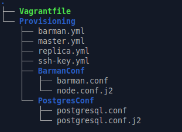

# ДЗ № 29
## Тема: "Репликация и бэкап PostgreSQL"
Задание:
- настроить hot_standby репликацию PostgreSQL с использованием слотов
- настроить резервное копирование PostgreSQL (с помощью barman)

## Выполнение задания
В рамках ДЗ подготовлен стенд, автоматически разварачивающийся с помощью vagrant и ansible
1. Vagrantfile - конфигурационный файл vagrant, поднимает две VM на ОС Ubuntu 24.04 server (виртуальная сеть hostonly):
  - Master (IP: 192.168.60.10)
  - Replica  (IP: 192.168.60.20)
  - Barman  (IP: 192.168.60.30)
2. master.yml, slave.yml, barman.yml и ssh_key.yml - сценарии Ansible, настраивают вышеуказанные VM
 - master.yml - на Master поднимает и настраивает PostgreSQL Server 16 с прицелом на репликацию и бэкап (используется шаблон postgresql.conf.j2)
 - slave.yml - на Replica поднимает и настраивает PostgreSQL Server 16 с hot_standby репликаций с Master (используется шаблон postgresql.conf.j2)
 - barman.yml - на Barman поднимает и настраивает сервер barman для бэкапирования данных с Master (используются основной конфиг barman.conf и шаблон node.conf.j2)
 - ssh_key.yml - настраивает SSH подключение с Barman на Master по ключу (для возможности автоматизированного восстановления данных из бэкапов) 

Файлы стенда: [Postgres.tar.gz](./Files/Postgres.tar.gz) 

Структура стенда \
 

### Проверяем изначальное состояние стенда (сразу после того, как VM автоматически развернулись)
На Master'е
```
vagrant@master:~$ sudo -i -u postgres
postgres@master:~$ psql -c "SELECT application_name, client_addr, state, sync_state FROM pg_stat_replication;"
 application_name |  client_addr  |   state   | sync_state 
------------------+---------------+-----------+------------
 walreceiver      | 192.168.60.20 | streaming | async
(1 row)

postgres@master:~$ psql -c "SELECT slot_name, plugin, slot_type, active, wal_status FROM pg_replication_slots;"
   slot_name    | plugin | slot_type | active | wal_status 
----------------+--------+-----------+--------+------------
 replica_slot_1 |        | physical  | t      | reserved
(1 row)

postgres@master:~$ psql -c "\l"
                                                       List of databases
   Name    |  Owner   | Encoding | Locale Provider |   Collate   |    Ctype    | ICU Locale | ICU Rules |   Access privileges   
-----------+----------+----------+-----------------+-------------+-------------+------------+-----------+-----------------------
 postgres  | postgres | UTF8     | libc            | en_US.UTF-8 | en_US.UTF-8 |            |           | 
 template0 | postgres | UTF8     | libc            | en_US.UTF-8 | en_US.UTF-8 |            |           | =c/postgres          +
           |          |          |                 |             |             |            |           | postgres=CTc/postgres
 template1 | postgres | UTF8     | libc            | en_US.UTF-8 | en_US.UTF-8 |            |           | =c/postgres          +
           |          |          |                 |             |             |            |           | postgres=CTc/postgres
(3 rows)

postgres@master:~$ psql -c "\dt+"
Did not find any relations.
```

На Replica
```
vagrant@replica:~$ sudo -i -u postgres
postgres@replica:~$ psql -c "SELECT pg_is_in_recovery();"
 pg_is_in_recovery 
-------------------
 t
(1 row)

postgres@replica:~$ psql -c "\l"
                                                       List of databases
   Name    |  Owner   | Encoding | Locale Provider |   Collate   |    Ctype    | ICU Locale | ICU Rules |   Access privileges   
-----------+----------+----------+-----------------+-------------+-------------+------------+-----------+-----------------------
 postgres  | postgres | UTF8     | libc            | en_US.UTF-8 | en_US.UTF-8 |            |           | 
 template0 | postgres | UTF8     | libc            | en_US.UTF-8 | en_US.UTF-8 |            |           | =c/postgres          +
           |          |          |                 |             |             |            |           | postgres=CTc/postgres
 template1 | postgres | UTF8     | libc            | en_US.UTF-8 | en_US.UTF-8 |            |           | =c/postgres          +
           |          |          |                 |             |             |            |           | postgres=CTc/postgres
(3 rows)

postgres@replica:~$ psql -c "\dt+"
Did not find any relations.
```
Видим, что изначально БД на Master и Replica пусты

Смотрим, что на Barman
```
vagrant@barman:~$ sudo -i -u barman
barman@barman:~$ barman check master
Server master:
	WAL archive: OK
	PostgreSQL: OK
	superuser or standard user with backup privileges: OK
	PostgreSQL streaming: OK
	wal_level: OK
	replication slot: OK
	directories: OK
	retention policy settings: OK
	backup maximum age: OK (no last_backup_maximum_age provided)
	backup minimum size: OK (0 B)
	wal maximum age: OK (no last_wal_maximum_age provided)
	wal size: OK (0 B)
	compression settings: OK
	failed backups: OK (there are 0 failed backups)
	minimum redundancy requirements: OK (have 0 backups, expected at least 0)
	pg_basebackup: OK
	pg_basebackup compatible: OK
	pg_basebackup supports tablespaces mapping: OK
	systemid coherence: OK (no system Id stored on disk)
	pg_receivexlog: OK
	pg_receivexlog compatible: OK
	receive-wal running: OK
	archiver errors: OK
```
Видим, что у barman есть необходимый доступ к PostgreSQL серверу на Master

### Проверяем работу репликации
На Master в основной БД создаем таблицу test и заносим в нее две записи
```
postgres@master:~$ psql -c "CREATE TABLE test (id serial PRIMARY KEY, data text);"
CREATE TABLE
postgres@master:~$ psql -c "INSERT INTO test (data) VALUES ('It is TEST.');"
INSERT 0 1
postgres@master:~$ psql -c "INSERT INTO test (data) VALUES ('1234567890');"
INSERT 0 1
postgres@master:~$ psql -c "\dt+"
                                  List of relations
 Schema | Name | Type  |  Owner   | Persistence | Access method | Size  | Description 
--------+------+-------+----------+-------------+---------------+-------+-------------
 public | test | table | postgres | permanent   | heap          | 16 kB | 
(1 row)

postgres@master:~$ psql -d postgres -c "SELECT * FROM test LIMIT 10;"
 id |    data     
----+-------------
  1 | It is TEST.
  2 | 1234567890
(2 rows)
```

Смотрим, что изменилось На Replica
```
postgres@replica:~$ psql -c "\dt+"
                                  List of relations
 Schema | Name | Type  |  Owner   | Persistence | Access method | Size  | Description 
--------+------+-------+----------+-------------+---------------+-------+-------------
 public | test | table | postgres | permanent   | heap          | 16 kB | 
(1 row)

postgres@replica:~$ psql -d postgres -c "SELECT * FROM test LIMIT 10;"
 id |    data     
----+-------------
  1 | It is TEST.
  2 | 1234567890
(2 rows)
```
Репликация работает

### Проверяем работу бэкапа
На Barman делаем бэкап БД с Master
```
barman@barman:~$ barman backup master
Starting backup using postgres method for server master in /var/lib/barman/master/base/20261004T191922
Backup start at LSN: 0/150000C8 (000000010000000000000015, 000000C8)
Starting backup copy via pg_basebackup for 20261004T191922
Copy done (time: less than one second)
Finalising the backup.
Backup size: 22.3 MiB
Backup end at LSN: 0/17000000 (000000010000000000000016, 00000000)
Backup completed (start time: 2026-10-04 19:19:22.192897, elapsed time: less than one second)
Processing xlog segments from streaming for master
	000000010000000000000014
	000000010000000000000015
	000000010000000000000016

barman@barman:~$ barman list-backup master
master 20261004T191615 - Sun Oct  4 22:16:15 2026 - Size: 22.4 MiB - WAL Size: 32.2 KiB
master 20261004T191922 - Sun Oct  4 22:19:22 2026 - Size: 22.4 MiB - WAL Size: 48.3 KiB
```

Идем на Master и добавляем 3-ю запись в таблицу test
```
postgres@master:~$ psql -c "INSERT INTO test (data) VALUES ('qwerty.');"
INSERT 0 1
postgres@master:~$ psql -d postgres -c "SELECT * FROM test LIMIT 10;"
 id |    data     
----+-------------
  1 | It is TEST.
  2 | 1234567890
  3 | qwerty.
(3 rows)
```

Переключаемся на root, тормозим postgresql и сносим БД (удаляем файлы из /var/lib/postgresql/16/main)
```
root@master:/home/vagrant# systemctl stop postgresql
root@master:/home/vagrant# cd /var/lib/postgresql/16/main
root@master:/var/lib/postgresql/16/main# rm ./*
```

Идем на Barman и восстанавливаем БД из бэкапа.
Важно понимать, что файлы настроек PostgreSQL сервера в бэкапе не сохранялись. \
При необходимости их можно забирать с Master и затем восстанавливать отдельным скриптом по SSH. 
```
barman@barman:~$ barman recover master 20261004T191922 /var/lib/postgresql/16/main/ --remote-ssh-command "ssh postgres@192.168.60.10"
Starting remote restore for server master using backup 20261004T191922
Destination directory: /var/lib/postgresql/16/main/
Remote command: ssh postgres@192.168.60.10
Copying the base backup.
Copying required WAL segments.
Generating archive status files
Identify dangerous settings in destination directory.

WARNING
The following configuration files have not been saved during backup, hence they have not been restored.
You need to manually restore them in order to start the recovered PostgreSQL instance:

    postgresql.conf
    pg_hba.conf
    pg_ident.conf

Recovery completed (start time: 2026-10-04 19:35:45.701578+00:00, elapsed time: 6 seconds)
Your PostgreSQL server has been successfully prepared for recovery!
```

Переходим на Master и запускаем postgresql
```
root@master:/var/lib/postgresql/16/main# systemctl start postgresql
```

Далее переключаемся на пользователя postgres и смотрим, что получилось в результате восстановления БД из бэкапа
```
postgres@replica:~$ psql -c "\dt+"
                                  List of relations
 Schema | Name | Type  |  Owner   | Persistence | Access method | Size  | Description 
--------+------+-------+----------+-------------+---------------+-------+-------------
 public | test | table | postgres | permanent   | heap          | 16 kB | 
(1 row)

postgres@master:~$ psql -d postgres -c "SELECT * FROM test LIMIT 10;"
 id |    data     
----+-------------
  1 | It is TEST.
  2 | 1234567890
(2 rows)
```

Все работает


